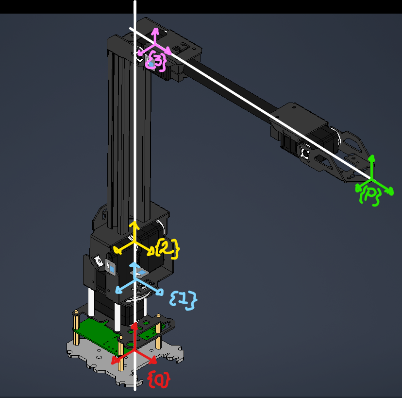

**Universidad Nacional Autónoma de México \- Facultad de Ingeniería \- Profesor: M.I. Erik Peña Medina**

# Proyecto:Introducción al Modelado Espacial de Robots

**Alumnos:**


 **Cruz Zamora Franco Sebastián** 


**Franco Ayala Carlos Alfonso**


**Manzano Martinez Nancy**


 **Nava Hernández Gerardo Saúl** 


**Ortiz Carreño Fabian**

# Resumen

El presente proyecto tiene como objetivo el desarrollo del modelo dinámico completo de un robot manipulador de 3 grados de libertad (3R) tipo RoArm, empleando el formalismo de Euler\-Lagrange como herramienta matemática principal. Este tipo de modelado es fundamental en robótica, ya que permite conocer las fuerzas y pares necesarios para controlar el movimiento del robot en el espacio tridimensional, considerando tanto los efectos inerciales como los gravitacionales y las fuerzas de Coriolis.


**Obtención de parámetros:**Como primera etapa, se extrajeron las propiedades físicas de cada uno de los eslabones que conforman el robot directamente desde el software de diseño asistido por computadora Autodesk Inventor, haciendo uso de la herramienta de Propiedades Físicas (iProperties). Los parámetros obtenidos incluyen la masa de cada eslabón, las coordenadas del centro de gravedad en los tres ejes, y los momentos másicos de inercia respecto al centro de gravedad (Ixx, Iyy, Izz). Dado que el modelo dinámico requiere que los centros de masa estén expresados en coordenadas relativas a cada articulación y no al origen global del ensamble, se realizó una corrección de los valores del centro de gravedad en el eje Z, restando el offset correspondiente a la posición de cada motor medido desde la base del robot. Todas las unidades fueron convertidas al Sistema Internacional (kilogramos, metros, segundos).


**Modelado cinemático de posición:** En la segunda etapa se construyó el modelo cinemático del robot mediante transformadas homogéneas, siguiendo la convención de rotaciones ZYX. Se definieron las matrices de transformación entre cada par de eslabones consecutivos (T₀₁, T₁₂, T₂₃, T₃ₚ), y mediante su producto encadenado se obtuvo la transformada total T₀ₚ que describe la posición y orientación del efector final respecto a la base. A partir de esta transformada se extrajo el vector de postura del robot y el vector de posición del efector final p₀ₚ.


 **Modelado cinemático de velocidades:** Se calculó el Jacobiano geométrico del robot J(θ) mediante diferenciación del vector de posición respecto a las coordenadas generalizadas. El determinante del Jacobiano fue evaluado simbólicamente para identificar las configuraciones singulares del robot, es decir, aquellas posiciones en las que el robot pierde uno o más grados de libertad. Adicionalmente se calcularon las velocidades angulares de cada eslabón mediante propagación desde la base hasta el efector final.


**Modelado dinámico Mediante Euler\-Lagrange:** En la etapa central del proyecto se aplicó el formalismo de Lagrange para obtener las ecuaciones de movimiento del robot. Para cada eslabón se calcularon su posición del centro de masa respecto al marco inercial, su velocidad lineal y su velocidad angular. Con estos elementos se formularon las energías cinéticas traslacional y rotacional de cada eslabón, así como las energías potenciales gravitacionales. El Lagrangeano del sistema se obtuvo como la diferencia entre la energía cinética total y la energía potencial total. Aplicando las ecuaciones de Euler\-Lagrange se derivaron los pares generalizados τ₁, τ₂ y τ₃ correspondientes a cada articulación, y mediante sustituciones selectivas se identificaron y separaron las tres matrices fundamentales del modelo dinámico:

-  **M(q):** Matriz de inercia del robot, simétrica y definida positiva, que relaciona las aceleraciones articulares con los pares necesarios. 
-  **V(q,q̇):** Vector de fuerzas de Coriolis y centrífugas, que depende tanto de las posiciones como de las velocidades articulares. 
-  **G(q):** Vector de fuerzas gravitacionales, que representa los pares necesarios para sostener el robot en una posición dada contra la gravedad.  

**Sustitución de parámetros y validación:** Finalmente, los parámetros físicos obtenidos del robot RoArm fueron sustituidos en el modelo dinámico simbólico, obteniendo expresiones numéricas en función únicamente de las coordenadas generalizadas. El modelo fue evaluado numéricamente en la configuración de referencia (θ₁ = θ₂ = θ₃ = 0, θ̇₁ = θ̇₂ = θ̇₃ = 0), obteniendo la matriz de inercia numérica M(q₀), así como los vectores V(q₀,0) = 0 y G(q₀) = 0, resultados coherentes con la física del sistema en dicha configuración.





*Imagen 1: Diagrama de coordenadas asignado para el RoArm*

# Trasformada homogenea

En robótica, para describir la posición y orientación de un eslabón respecto a otro se utilizan las **transformadas homogéneas**, que son matrices de 4×4 que combinan en una sola operación tanto la rotación como la traslación entre dos sistemas de referencia consecutivos.


En este proyecto se define una función simbólica general `Tij` que recibe seis parámetros: las traslaciones en X, Y y Z, y los ángulos de rotación gamma (γ), beta (β) y alfa (α), siguiendo la convención de rotaciones **ZYX** (también conocida como ángulos de Euler). La matriz resultante tiene la forma:

```matlab
%T = | R  p |
%    | 0  1 |
```

Donde **R** es la matriz de rotación 3×3 que describe la orientación relativa entre dos eslabones, y **p** es el vector de posición 3×1 que indica la traslación entre sus orígenes.


Esta función es la piedra angular de todo el proyecto, ya que será reutilizada a lo largo del código para construir todas las transformadas entre eslabones, calcular las posiciones de los centros de masa, y derivar tanto el modelo cinemático como el dinámico del robot. Cada vez que se llame a `Tij` con parámetros específicos, se estará describiendo cómo se mueve y rota un eslabón respecto al anterior.

```matlab
syms Tij(x_i_j,y_i_j,z_i_j,gi_j,bi_j,ai_j)

% Homogeneous transform
Tij(x_i_j,y_i_j,z_i_j,gi_j,bi_j,ai_j) = [cos(ai_j)*cos(bi_j) cos(ai_j)*sin(bi_j)*sin(gi_j)-sin(ai_j)*cos(gi_j) sin(ai_j)*sin(gi_j)+cos(ai_j)*sin(bi_j)*cos(gi_j) x_i_j; sin(ai_j)*cos(bi_j) cos(ai_j)*cos(gi_j)+sin(ai_j)*sin(bi_j)*sin(gi_j) sin(ai_j)*sin(bi_j)*cos(gi_j)-cos(ai_j)*sin(gi_j) y_i_j; -sin(bi_j) cos(bi_j)*sin(gi_j) cos(bi_j)*cos(gi_j) z_i_j; 0 0 0 1]
```
Tij(x_i_j, y_i_j, z_i_j, gi_j, bi_j, ai_j) = 

  $$ \displaystyle \left(\begin{array}{cccc} \cos \left({\textrm{ai}}_j \right)\,\cos \left({\textrm{bi}}_j \right) & \cos \left({\textrm{ai}}_j \right)\,\sin \left({\textrm{bi}}_j \right)\,\sin \left({\textrm{gi}}_j \right)-\cos \left({\textrm{gi}}_j \right)\,\sin \left({\textrm{ai}}_j \right) & \sin \left({\textrm{ai}}_j \right)\,\sin \left({\textrm{gi}}_j \right)+\cos \left({\textrm{ai}}_j \right)\,\cos \left({\textrm{gi}}_j \right)\,\sin \left({\textrm{bi}}_j \right) & x_{i,j} \newline \cos \left({\textrm{bi}}_j \right)\,\sin \left({\textrm{ai}}_j \right) & \cos \left({\textrm{ai}}_j \right)\,\cos \left({\textrm{gi}}_j \right)+\sin \left({\textrm{ai}}_j \right)\,\sin \left({\textrm{bi}}_j \right)\,\sin \left({\textrm{gi}}_j \right) & \cos \left({\textrm{gi}}_j \right)\,\sin \left({\textrm{ai}}_j \right)\,\sin \left({\textrm{bi}}_j \right)-\cos \left({\textrm{ai}}_j \right)\,\sin \left({\textrm{gi}}_j \right) & y_{i,j} \newline -\sin \left({\textrm{bi}}_j \right) & \cos \left({\textrm{bi}}_j \right)\,\sin \left({\textrm{gi}}_j \right) & \cos \left({\textrm{bi}}_j \right)\,\cos \left({\textrm{gi}}_j \right) & z_{i,j} \newline 0 & 0 & 0 & 1 \end{array}\right) $$ 
 

# Modelado de la posición del robot 3R

Una vez definida la transformada homogénea general, se procede a construir el modelo de posición del robot. Para ello se definen dos tipos de variables simbólicas:

-  **Parámetros geométricos:** `z_O_1`, `z_1_2`, `z_2_3`, `z_3_P`, que representan las distancias entre articulaciones consecutivas a lo largo del eje Z de cada eslabón. Estos valores corresponden a las longitudes físicas medidas del robot RoArm. 
-  **Grados de libertad:** `theta_O_1`, `theta_1_2`, `theta_2_3`, que son los ángulos de rotación de cada articulación y constituyen las coordenadas generalizadas del sistema. Estos son los valores que cambian durante el movimiento del robot. 

Con estas variables se construyen las transformadas homogéneas individuales entre cada par de eslabones consecutivos:

```matlab
syms z_O_1 z_1_2 z_2_3 z_3_P  %parametros
syms theta_O_1 theta_1_2 theta_2_3 %grados de libertad
%T_O_1 → rotación en Z (cintura)
T_O_1 = Tij(0,0,z_O_1,0,0,theta_O_1)
```
T_O_1 = 

  $$ \displaystyle \left(\begin{array}{cccc} \cos \left(\theta_{O,1} \right) & -\sin \left(\theta_{O,1} \right) & 0 & 0\newline \sin \left(\theta_{O,1} \right) & \cos \left(\theta_{O,1} \right) & 0 & 0\newline 0 & 0 & 1 & z_{O,1} \newline 0 & 0 & 0 & 1 \end{array}\right) $$ 
 

```matlab
%T_1_2 → rotación en Y (hombro)
T_1_2 = Tij(0,0,z_1_2,0,theta_1_2,0)
```
T_1_2 = 

  $$ \displaystyle \left(\begin{array}{cccc} \cos \left(\theta_{1,2} \right) & 0 & \sin \left(\theta_{1,2} \right) & 0\newline 0 & 1 & 0 & 0\newline -\sin \left(\theta_{1,2} \right) & 0 & \cos \left(\theta_{1,2} \right) & z_{1,2} \newline 0 & 0 & 0 & 1 \end{array}\right) $$ 
 

```matlab
%T_2_3 → rotación en Y (codo)
T_2_3 = Tij(0,0,z_2_3,0,theta_2_3,0)
```
T_2_3 = 

  $$ \displaystyle \left(\begin{array}{cccc} \cos \left(\theta_{2,3} \right) & 0 & \sin \left(\theta_{2,3} \right) & 0\newline 0 & 1 & 0 & 0\newline -\sin \left(\theta_{2,3} \right) & 0 & \cos \left(\theta_{2,3} \right) & z_{2,3} \newline 0 & 0 & 0 & 1 \end{array}\right) $$ 
 

```matlab
%T_3_P → traslación pura hacia el efector final
T_3_P = Tij(0,0,z_3_P,0,0,0)
```
T_3_P = 

  $$ \displaystyle \left(\begin{array}{cccc} 1 & 0 & 0 & 0\newline 0 & 1 & 0 & 0\newline 0 & 0 & 1 & z_{3,P} \newline 0 & 0 & 0 & 1 \end{array}\right) $$ 
 

Nótese que la primera articulación rota sobre el eje Z porque es la que permite girar horizontalmente al robot (cintura), mientras que las articulaciones 2 y 3 rotan sobre el eje Y porque generan movimiento en el plano vertical (elevación del brazo).


Finalmente, la transformada total del robot desde la base hasta el efector final se obtiene multiplicando encadenadamente todas las transformadas individuales:

```matlab
%T_O_P = T_O_1 · T_1_2 · T_2_3 · T_3_P
T_O_P = simplify(T_O_1*T_1_2*T_2_3*T_3_P)
```
T_O_P = 

  $$ \displaystyle \begin{array}{l} \left(\begin{array}{cccc} \cos \left(\theta_{1,2} +\theta_{2,3} \right)\,\cos \left(\theta_{O,1} \right) & -\sin \left(\theta_{O,1} \right) & \sin \left(\theta_{1,2} +\theta_{2,3} \right)\,\cos \left(\theta_{O,1} \right) & \cos \left(\theta_{O,1} \right)\,\sigma_1 \newline \cos \left(\theta_{1,2} +\theta_{2,3} \right)\,\sin \left(\theta_{O,1} \right) & \cos \left(\theta_{O,1} \right) & \sin \left(\theta_{1,2} +\theta_{2,3} \right)\,\sin \left(\theta_{O,1} \right) & \sin \left(\theta_{O,1} \right)\,\sigma_1 \newline -\sin \left(\theta_{1,2} +\theta_{2,3} \right) & 0 & \cos \left(\theta_{1,2} +\theta_{2,3} \right) & z_{1,2} +z_{O,1} +z_{3,P} \,\cos \left(\theta_{1,2} +\theta_{2,3} \right)+z_{2,3} \,\cos \left(\theta_{1,2} \right)\newline 0 & 0 & 0 & 1 \end{array}\right)\\\mathrm{}\\\textrm{where}\\\mathrm{}\\\;\;\sigma_1 =z_{3,P} \,\sin \left(\theta_{1,2} +\theta_{2,3} \right)+z_{2,3} \,\sin \left(\theta_{1,2} \right)\end{array} $$ 
 

Esta matriz 4×4 contiene toda la información necesaria para conocer en cualquier instante dónde se encuentra el efector final del robot y con qué orientación, dados los ángulos de las tres articulaciones. A partir de ella se extrae el **vector de postura** `xi_O_P` que resume en 6 componentes la posición (x, y, z) y orientación del efector, y el **vector de posición** `p_O_P` que contiene únicamente las coordenadas cartesianas del efector final.


**Vector de postura**

```matlab
xi_O_P = [T_O_P(1,4); T_O_P(2,4); T_O_P(3,4); T_O_P(1,1); T_O_P(2,2); T_O_P(3,3)]
```
xi_O_P = 

  $$ \displaystyle \left(\begin{array}{c} \cos \left(\theta_{O,1} \right)\,{\left(z_{3,P} \,\sin \left(\theta_{1,2} +\theta_{2,3} \right)+z_{2,3} \,\sin \left(\theta_{1,2} \right)\right)}\newline \sin \left(\theta_{O,1} \right)\,{\left(z_{3,P} \,\sin \left(\theta_{1,2} +\theta_{2,3} \right)+z_{2,3} \,\sin \left(\theta_{1,2} \right)\right)}\newline z_{1,2} +z_{O,1} +z_{3,P} \,\cos \left(\theta_{1,2} +\theta_{2,3} \right)+z_{2,3} \,\cos \left(\theta_{1,2} \right)\newline \cos \left(\theta_{1,2} +\theta_{2,3} \right)\,\cos \left(\theta_{O,1} \right)\newline \cos \left(\theta_{O,1} \right)\newline \cos \left(\theta_{1,2} +\theta_{2,3} \right) \end{array}\right) $$ 
 

```matlab

p_O_P = [T_O_P(1,4); T_O_P(2,4); T_O_P(3,4)]
```
p_O_P = 

  $$ \displaystyle \left(\begin{array}{c} \cos \left(\theta_{O,1} \right)\,{\left(z_{3,P} \,\sin \left(\theta_{1,2} +\theta_{2,3} \right)+z_{2,3} \,\sin \left(\theta_{1,2} \right)\right)}\newline \sin \left(\theta_{O,1} \right)\,{\left(z_{3,P} \,\sin \left(\theta_{1,2} +\theta_{2,3} \right)+z_{2,3} \,\sin \left(\theta_{1,2} \right)\right)}\newline z_{1,2} +z_{O,1} +z_{3,P} \,\cos \left(\theta_{1,2} +\theta_{2,3} \right)+z_{2,3} \,\cos \left(\theta_{1,2} \right) \end{array}\right) $$ 
 

# Modelo cinemático directo de las velocidades

Conocer la posición del efector final en función de los ángulos articulares es útil, pero en la práctica también es necesario relacionar las **velocidades articulares** (qué tan rápido giran los motores) con la **velocidad del efector final** (qué tan rápido se mueve la herramienta en el espacio). Esta relación la establece el **Jacobiano geométrico** J(θ).


El Jacobiano es una matriz de 3×3 que se obtiene diferenciando el vector de posición del efector `p_O_P` respecto a cada una de las coordenadas generalizadas:


**v\_efector = J(θ) · θ**̇


donde:


v\_efector → velocidad cartesiana del efector \[3×1\]


J(θ)      → matriz Jacobiana              \[3×3\]


θ̇         → velocidades articulares       \[3×1\]


**Calculo del Jacobino**


En el código se calcula usando la función `jacobian` de MATLAB, que realiza automáticamente todas las derivadas parciales simbólicas.

```matlab

%J_theta = simplify(jacobian(xi_O_P,[theta_O_1,theta_1_2, theta_2_3]))
J_theta = simplify(jacobian(p_O_P, [theta_O_1, theta_1_2, theta_2_3]));
```

**Determinante del Jacobiano**


Un resultado particularmente importante es el **determinante de J(θ)**. Este valor indica si el robot se encuentra en una **configuración singular**, es decir, una posición en la que el robot pierde la capacidad de moverse en alguna dirección del espacio, sin importar qué tan rápido giren sus motores. Matemáticamente esto ocurre cuando:


det(J(θ)) = 0  →  configuración singular  ️


det(J(θ)) ≠ 0  →  configuración regular   


Las singularidades son críticas en el diseño de trayectorias del robot porque en esas configuraciones el control se vuelve inestable y pueden generarse velocidades articulares infinitas.

```matlab
det(J_theta)
```
ans = 

  $$ \displaystyle \begin{array}{l} \cos \left(\theta_{1,2} \right)\,{z_{2,3} }^2 \,z_{3,P} \,\sin \left(\theta_{1,2} +\theta_{2,3} \right)\,{\cos \left(\theta_{O,1} \right)}^2 \,\sin \left(\theta_{1,2} \right)+\cos \left(\theta_{1,2} \right)\,{z_{2,3} }^2 \,z_{3,P} \,\sin \left(\theta_{1,2} +\theta_{2,3} \right)\,\sin \left(\theta_{1,2} \right)\,{\sin \left(\theta_{O,1} \right)}^2 -\cos \left(\theta_{1,2} +\theta_{2,3} \right)\,{z_{2,3} }^2 \,z_{3,P} \,{\cos \left(\theta_{O,1} \right)}^2 \,{\sin \left(\theta_{1,2} \right)}^2 -\cos \left(\theta_{1,2} +\theta_{2,3} \right)\,{z_{2,3} }^2 \,z_{3,P} \,{\sin \left(\theta_{1,2} \right)}^2 \,{\sin \left(\theta_{O,1} \right)}^2 +\cos \left(\theta_{1,2} \right)\,z_{2,3} \,{z_{3,P} }^2 \,\sigma_1 \,{\cos \left(\theta_{O,1} \right)}^2 +\cos \left(\theta_{1,2} \right)\,z_{2,3} \,{z_{3,P} }^2 \,\sigma_1 \,{\sin \left(\theta_{O,1} \right)}^2 -\cos \left(\theta_{1,2} +\theta_{2,3} \right)\,z_{2,3} \,{z_{3,P} }^2 \,\sin \left(\theta_{1,2} +\theta_{2,3} \right)\,{\cos \left(\theta_{O,1} \right)}^2 \,\sin \left(\theta_{1,2} \right)-\cos \left(\theta_{1,2} +\theta_{2,3} \right)\,z_{2,3} \,{z_{3,P} }^2 \,\sin \left(\theta_{1,2} +\theta_{2,3} \right)\,\sin \left(\theta_{1,2} \right)\,{\sin \left(\theta_{O,1} \right)}^2 \newline \mathrm{}\newline \textrm{where}\newline \mathrm{}\newline \;\;\sigma_1 ={\sin \left(\theta_{1,2} +\theta_{2,3} \right)}^2  \end{array} $$ 
 

## Modelo cinemático inverso de las velocidades

La pseudoinversa del Jacobiano se presenta  como referencia para el modelo cinemático  inverso de velocidades. Su cálculo simbólico  completo queda fuera del alcance de este  proyecto debido a su complejidad computacional,  sin embargo su formulación es:si

```matlab
%J_theta_psin = pinv(J_theta)
```

# Modelo dinámico del robot en el espacio

El modelo dinámico es la parte central del proyecto. A diferencia del modelo cinemático que solo describe **dónde está** y **cómo se mueve** el robot, el modelo dinámico responde a la pregunta fundamental del control: **¿cuánta fuerza o par debe aplicar cada motor para lograr un movimiento deseado?**


Para obtener este modelo se utiliza el **formalismo de Euler\-Lagrange**, que es un enfoque energético basado en dos conceptos:


Energía cinética  K → energía del movimiento


Energía potencial U → energía almacenada por gravedad


Lagrangeano: L = K \- U


**Cálculo de los Centros de Masa de los Eslabones**


Para cada eslabón se define una transformada homogénea adicional `T_i_Ci` que ubica el centro de masa del eslabón i respecto a su propia articulación, usando los valores `z_1_C1`, `z_2_C2`, `z_3_C3` obtenidos y corregidos del robot RoArm. Combinando esta transformada con las del modelo cinemático se obtiene la posición de cada centro de masa respecto al marco inercial de la base `p_O_Ci`. Finalmente, las velocidades lineales de cada centro de masa `v_O_Ci` se obtienen diferenciando su posición respecto a cada coordenada generalizada activa.

```matlab
syms theta_dot_O_1 theta_dot_1_2 theta_dot_2_3 z_1_C1 z_2_C2 z_3_C3

T_1_C1 = Tij(0,0,z_1_C1,0,0,0)
```
T_1_C1 = 

  $$ \displaystyle \left(\begin{array}{cccc} 1 & 0 & 0 & 0\newline 0 & 1 & 0 & 0\newline 0 & 0 & 1 & z_{1,\textrm{C1}} \newline 0 & 0 & 0 & 1 \end{array}\right) $$ 
 

```matlab

T_O_C1 = simplify(T_O_1*T_1_C1);

p_O_C1 = [T_O_C1(1,4); T_O_C1(2,4); T_O_C1(3,4)]
```
p_O_C1 = 

  $$ \displaystyle \left(\begin{array}{c} 0\newline 0\newline z_{1,\textrm{C1}} +z_{O,1}  \end{array}\right) $$ 
 

```matlab

v_O_C1 = diff(p_O_C1, theta_O_1)*theta_dot_O_1 
```
v_O_C1 = 

  $$ \displaystyle \left(\begin{array}{c} 0\newline 0\newline 0 \end{array}\right) $$ 
 

```matlab
%

T_2_C2 = Tij(0,0,z_2_C2,0,0,0)
```
T_2_C2 = 

  $$ \displaystyle \left(\begin{array}{cccc} 1 & 0 & 0 & 0\newline 0 & 1 & 0 & 0\newline 0 & 0 & 1 & z_{2,\textrm{C2}} \newline 0 & 0 & 0 & 1 \end{array}\right) $$ 
 

```matlab

T_O_C2 = simplify(T_O_1*T_1_2*T_2_C2);

p_O_C2 = [T_O_C2(1,4); T_O_C2(2,4); T_O_C2(3,4)]
```
p_O_C2 = 

  $$ \displaystyle \left(\begin{array}{c} z_{2,\textrm{C2}} \,\cos \left(\theta_{O,1} \right)\,\sin \left(\theta_{1,2} \right)\newline z_{2,\textrm{C2}} \,\sin \left(\theta_{1,2} \right)\,\sin \left(\theta_{O,1} \right)\newline z_{1,2} +z_{O,1} +z_{2,\textrm{C2}} \,\cos \left(\theta_{1,2} \right) \end{array}\right) $$ 
 

```matlab

v_O_C2 = diff(p_O_C2, theta_O_1)*theta_dot_O_1 + diff(p_O_C2, theta_1_2)*theta_dot_1_2
```
v_O_C2 = 

  $$ \displaystyle \left(\begin{array}{c} {\dot{\theta} }_{1,2} \,z_{2,\textrm{C2}} \,\cos \left(\theta_{1,2} \right)\,\cos \left(\theta_{O,1} \right)-{\dot{\theta} }_{O,1} \,z_{2,\textrm{C2}} \,\sin \left(\theta_{1,2} \right)\,\sin \left(\theta_{O,1} \right)\newline {\dot{\theta} }_{1,2} \,z_{2,\textrm{C2}} \,\cos \left(\theta_{1,2} \right)\,\sin \left(\theta_{O,1} \right)+{\dot{\theta} }_{O,1} \,z_{2,\textrm{C2}} \,\cos \left(\theta_{O,1} \right)\,\sin \left(\theta_{1,2} \right)\newline -{\dot{\theta} }_{1,2} \,z_{2,\textrm{C2}} \,\sin \left(\theta_{1,2} \right) \end{array}\right) $$ 
 

```matlab

%

T_3_C3 = Tij(0,0,z_3_C3,0,0,0)
```
T_3_C3 = 

  $$ \displaystyle \left(\begin{array}{cccc} 1 & 0 & 0 & 0\newline 0 & 1 & 0 & 0\newline 0 & 0 & 1 & z_{3,\textrm{C3}} \newline 0 & 0 & 0 & 1 \end{array}\right) $$ 
 

```matlab

T_O_C3 = simplify(T_O_1*T_1_2*T_2_3*T_3_C3);

p_O_C3 = [T_O_C3(1,4); T_O_C3(2,4); T_O_C3(3,4)]
```
p_O_C3 = 

  $$ \displaystyle \left(\begin{array}{c} \cos \left(\theta_{O,1} \right)\,{\left(z_{3,\textrm{C3}} \,\sin \left(\theta_{1,2} +\theta_{2,3} \right)+z_{2,3} \,\sin \left(\theta_{1,2} \right)\right)}\newline \sin \left(\theta_{O,1} \right)\,{\left(z_{3,\textrm{C3}} \,\sin \left(\theta_{1,2} +\theta_{2,3} \right)+z_{2,3} \,\sin \left(\theta_{1,2} \right)\right)}\newline z_{1,2} +z_{O,1} +z_{3,\textrm{C3}} \,\cos \left(\theta_{1,2} +\theta_{2,3} \right)+z_{2,3} \,\cos \left(\theta_{1,2} \right) \end{array}\right) $$ 
 

```matlab

v_O_C3 = diff(p_O_C3, theta_O_1)*theta_dot_O_1 + diff(p_O_C3, theta_1_2)*theta_dot_1_2 + diff(p_O_C3, theta_2_3)*theta_dot_2_3
```
v_O_C3 = 

  $$ \displaystyle \begin{array}{l} \left(\begin{array}{c} {\dot{\theta} }_{1,2} \,\cos \left(\theta_{O,1} \right)\,\sigma_2 -{\dot{\theta} }_{O,1} \,\sin \left(\theta_{O,1} \right)\,\sigma_1 +{\dot{\theta} }_{2,3} \,z_{3,\textrm{C3}} \,\cos \left(\theta_{1,2} +\theta_{2,3} \right)\,\cos \left(\theta_{O,1} \right)\newline {\dot{\theta} }_{1,2} \,\sin \left(\theta_{O,1} \right)\,\sigma_2 +{\dot{\theta} }_{O,1} \,\cos \left(\theta_{O,1} \right)\,\sigma_1 +{\dot{\theta} }_{2,3} \,z_{3,\textrm{C3}} \,\cos \left(\theta_{1,2} +\theta_{2,3} \right)\,\sin \left(\theta_{O,1} \right)\newline -{\dot{\theta} }_{1,2} \,\sigma_1 -{\dot{\theta} }_{2,3} \,z_{3,\textrm{C3}} \,\sin \left(\theta_{1,2} +\theta_{2,3} \right) \end{array}\right)\\\mathrm{}\\\textrm{where}\\\mathrm{}\\\;\;\sigma_1 =z_{3,\textrm{C3}} \,\sin \left(\theta_{1,2} +\theta_{2,3} \right)+z_{2,3} \,\sin \left(\theta_{1,2} \right)\\\mathrm{}\\\;\;\sigma_2 =z_{3,\textrm{C3}} \,\cos \left(\theta_{1,2} +\theta_{2,3} \right)+z_{2,3} \,\cos \left(\theta_{1,2} \right)\end{array} $$ 
 


**Propagación de las Velocidades Angulares**


Las velocidades angulares de cada eslabón no se pueden obtener simplemente diferenciando posiciones, ya que están expresadas en marcos de referencia distintos. Por ello se utiliza el método de propagación, que parte de la base con velocidad angular cero y va acumulando la contribución de cada articulación usando las matrices de rotación inversas entre eslabones. Los vectores `nu_1`, `nu_2`, `nu_3` indican el eje de giro de cada articulación en su propio marco de referencia:


nu\_1 = \[0;0;1\] → cintura gira sobre Z


nu\_2 = \[0;1;0\] → antebrazo gira sobre Y


nu\_3 = \[0;1;0\] → brazo gira sobre Y

```matlab
% Matrices de Rotación

R_O_1 = [T_O_1(1,1),T_O_1(1,2),T_O_1(2,3); T_O_1(2,1),T_O_1(1,2),T_O_1(2,3);T_O_1(3,1),T_O_1(3,2),T_O_1(3,3)];
R_1_O = transpose(R_O_1)
```
R_1_O = 

  $$ \displaystyle \left(\begin{array}{ccc} \cos \left(\theta_{O,1} \right) & \sin \left(\theta_{O,1} \right) & 0\newline -\sin \left(\theta_{O,1} \right) & -\sin \left(\theta_{O,1} \right) & 0\newline 0 & 0 & 1 \end{array}\right) $$ 
 

```matlab

R_1_2 = [T_1_2(1,1),T_1_2(1,2),T_1_2(2,3); T_1_2(2,1),T_1_2(1,2),T_1_2(2,3);T_1_2(3,1),T_1_2(3,2),T_1_2(3,3)];
R_2_1 = transpose(R_1_2)
```
R_2_1 = 

  $$ \displaystyle \left(\begin{array}{ccc} \cos \left(\theta_{1,2} \right) & 0 & -\sin \left(\theta_{1,2} \right)\newline 0 & 0 & 0\newline 0 & 0 & \cos \left(\theta_{1,2} \right) \end{array}\right) $$ 
 

```matlab

R_2_3 = [T_2_3(1,1),T_2_3(1,2),T_2_3(2,3); T_2_3(2,1),T_2_3(1,2),T_2_3(2,3);T_2_3(3,1),T_2_3(3,2),T_2_3(3,3)];
R_3_2 = transpose(R_2_3)
```
R_3_2 = 

  $$ \displaystyle \left(\begin{array}{ccc} \cos \left(\theta_{2,3} \right) & 0 & -\sin \left(\theta_{2,3} \right)\newline 0 & 0 & 0\newline 0 & 0 & \cos \left(\theta_{2,3} \right) \end{array}\right) $$ 
 

```matlab

% calculo de las velocidades angulares
omega_O_O = [0;0;0];
nu_1 = [0;0;1];
omega_1_1 = R_O_1*omega_O_O + nu_1*theta_dot_O_1
```
omega_1_1 = 

  $$ \displaystyle \left(\begin{array}{c} 0\newline 0\newline {\dot{\theta} }_{O,1}  \end{array}\right) $$ 
 

```matlab

nu_2 = [0;1;0];
omega_2_2 = R_2_1*omega_1_1 + nu_2*theta_dot_1_2
```
omega_2_2 = 

  $$ \displaystyle \left(\begin{array}{c} -{\dot{\theta} }_{O,1} \,\sin \left(\theta_{1,2} \right)\newline {\dot{\theta} }_{1,2} \newline {\dot{\theta} }_{O,1} \,\cos \left(\theta_{1,2} \right) \end{array}\right) $$ 
 

```matlab

nu_3 = [0;1;0];
omega_3_3 = R_3_2*omega_2_2 + nu_3*theta_dot_2_3
```
omega_3_3 = 

  $$ \displaystyle \left(\begin{array}{c} -{\dot{\theta} }_{O,1} \,\cos \left(\theta_{1,2} \right)\,\sin \left(\theta_{2,3} \right)-{\dot{\theta} }_{O,1} \,\cos \left(\theta_{2,3} \right)\,\sin \left(\theta_{1,2} \right)\newline {\dot{\theta} }_{2,3} \newline {\dot{\theta} }_{O,1} \,\cos \left(\theta_{1,2} \right)\,\cos \left(\theta_{2,3} \right) \end{array}\right) $$ 
 

**Matrices de Inercia**


Las matrices de inercia de cada eslabón se definen como matrices diagonales 3×3, asumiendo que los ejes del modelo coinciden con los ejes principales de inercia de cada pieza. Los valores de la diagonal `Ixx`, `Iyy`, `Izz` fueron obtenidos directamente de Inventor para cada eslabón del robot RoArm.

```matlab
syms I_xx1 I_yy1 I_zz1 I_xx2 I_yy2 I_zz2 I_xx3 I_yy3 I_zz3

I_C1 = [I_xx1, 0, 0; 0, I_yy1, 0; 0, 0, I_zz1]
```
I_C1 = 

  $$ \displaystyle \left(\begin{array}{ccc} I_{\textrm{xx1}}  & 0 & 0\newline 0 & I_{\textrm{yy1}}  & 0\newline 0 & 0 & I_{\textrm{zz1}}  \end{array}\right) $$ 
 

```matlab
I_C2 = [I_xx2, 0, 0; 0, I_yy2, 0; 0, 0, I_zz2]
```
I_C2 = 

  $$ \displaystyle \left(\begin{array}{ccc} I_{\textrm{xx2}}  & 0 & 0\newline 0 & I_{\textrm{yy2}}  & 0\newline 0 & 0 & I_{\textrm{zz2}}  \end{array}\right) $$ 
 

```matlab
I_C3 = [I_xx3, 0, 0; 0, I_yy3, 0; 0, 0, I_zz3]
```
I_C3 = 

  $$ \displaystyle \left(\begin{array}{ccc} I_{\textrm{xx3}}  & 0 & 0\newline 0 & I_{\textrm{yy3}}  & 0\newline 0 & 0 & I_{\textrm{zz3}}  \end{array}\right) $$ 
 


**Cálculo del Lagrangeano**


Con todos los elementos anteriores se calculan las energías del sistema. La energía cinética de cada eslabón tiene dos componentes, la traslacional asociada al movimiento de su centro de masa, y la rotacional asociada a su velocidad angular. La energía potencial de cada eslabón depende de la altura de su centro de masa respecto al plano de referencia. El Lagrangeano total es la diferencia entre la suma de energías cinéticas y la suma de energías potenciales.

```matlab
syms m_1 m_2 m_3 g

% energía cinetica
k_1 = 1/2*m_1*transpose(v_O_C1)*v_O_C1 + transpose(omega_1_1)*I_C1*omega_1_1
```
k_1 = 
 $\displaystyle I_{\textrm{zz1}} \,{{\dot{\theta} }_{O,1} }^2 $
 

```matlab
k_2 = 1/2*m_2*transpose(v_O_C2)*v_O_C2 + transpose(omega_2_2)*I_C2*omega_2_2
```
k_2 = 
 $\displaystyle I_{\textrm{yy2}} \,{{\dot{\theta} }_{1,2} }^2 +\frac{m_2 \,{{\left({\dot{\theta} }_{1,2} \,z_{2,\textrm{C2}} \,\cos \left(\theta_{1,2} \right)\,\sin \left(\theta_{O,1} \right)+{\dot{\theta} }_{O,1} \,z_{2,\textrm{C2}} \,\cos \left(\theta_{O,1} \right)\,\sin \left(\theta_{1,2} \right)\right)}}^2 }{2}+\frac{m_2 \,{{\left({\dot{\theta} }_{O,1} \,z_{2,\textrm{C2}} \,\sin \left(\theta_{1,2} \right)\,\sin \left(\theta_{O,1} \right)-{\dot{\theta} }_{1,2} \,z_{2,\textrm{C2}} \,\cos \left(\theta_{1,2} \right)\,\cos \left(\theta_{O,1} \right)\right)}}^2 }{2}+I_{\textrm{zz2}} \,{{\dot{\theta} }_{O,1} }^2 \,{\cos \left(\theta_{1,2} \right)}^2 +I_{\textrm{xx2}} \,{{\dot{\theta} }_{O,1} }^2 \,{\sin \left(\theta_{1,2} \right)}^2 +\frac{m_2 \,{{\dot{\theta} }_{1,2} }^2 \,{z_{2,\textrm{C2}} }^2 \,{\sin \left(\theta_{1,2} \right)}^2 }{2}$
 

```matlab
k_3 = 1/2*m_3*transpose(v_O_C3)*v_O_C3 + transpose(omega_3_3)*I_C1*omega_3_3
```
k_3 = 

  $$ \displaystyle \begin{array}{l} \frac{m_3 \,{{\left({\dot{\theta} }_{1,2} \,\cos \left(\theta_{O,1} \right)\,\sigma_2 -{\dot{\theta} }_{O,1} \,\sin \left(\theta_{O,1} \right)\,\sigma_1 +{\dot{\theta} }_{2,3} \,z_{3,\textrm{C3}} \,\cos \left(\theta_{1,2} +\theta_{2,3} \right)\,\cos \left(\theta_{O,1} \right)\right)}}^2 }{2}+\frac{m_3 \,{{\left({\dot{\theta} }_{1,2} \,\sigma_1 +{\dot{\theta} }_{2,3} \,z_{3,\textrm{C3}} \,\sin \left(\theta_{1,2} +\theta_{2,3} \right)\right)}}^2 }{2}+\frac{m_3 \,{{\left({\dot{\theta} }_{1,2} \,\sin \left(\theta_{O,1} \right)\,\sigma_2 +{\dot{\theta} }_{O,1} \,\cos \left(\theta_{O,1} \right)\,\sigma_1 +{\dot{\theta} }_{2,3} \,z_{3,\textrm{C3}} \,\cos \left(\theta_{1,2} +\theta_{2,3} \right)\,\sin \left(\theta_{O,1} \right)\right)}}^2 }{2}+I_{\textrm{yy1}} \,{{\dot{\theta} }_{2,3} }^2 +I_{\textrm{xx1}} \,{{\left({\dot{\theta} }_{O,1} \,\cos \left(\theta_{1,2} \right)\,\sin \left(\theta_{2,3} \right)+{\dot{\theta} }_{O,1} \,\cos \left(\theta_{2,3} \right)\,\sin \left(\theta_{1,2} \right)\right)}}^2 +I_{\textrm{zz1}} \,{{\dot{\theta} }_{O,1} }^2 \,{\cos \left(\theta_{1,2} \right)}^2 \,{\cos \left(\theta_{2,3} \right)}^2 \newline \mathrm{}\newline \textrm{where}\newline \mathrm{}\newline \;\;\sigma_1 =z_{3,\textrm{C3}} \,\sin \left(\theta_{1,2} +\theta_{2,3} \right)+z_{2,3} \,\sin \left(\theta_{1,2} \right)\newline \mathrm{}\newline \;\;\sigma_2 =z_{3,\textrm{C3}} \,\cos \left(\theta_{1,2} +\theta_{2,3} \right)+z_{2,3} \,\cos \left(\theta_{1,2} \right) \end{array} $$ 
 

```matlab
% energía potencial
g_O = [0;0;-g];

u_1 = -m_1*transpose(p_O_C1)*g_O
```
u_1 = 
 $\displaystyle g\,m_1 \,{\left(z_{1,\textrm{C1}} +z_{O,1} \right)}$
 

```matlab
u_2 = -m_2*transpose(p_O_C2)*g_O
```
u_2 = 
 $\displaystyle g\,m_2 \,{\left(z_{1,2} +z_{O,1} +z_{2,\textrm{C2}} \,\cos \left(\theta_{1,2} \right)\right)}$
 

```matlab
u_3 = -m_3*transpose(p_O_C3)*g_O
```
u_3 = 
 $\displaystyle g\,m_3 \,{\left(z_{1,2} +z_{O,1} +z_{3,\textrm{C3}} \,\cos \left(\theta_{1,2} +\theta_{2,3} \right)+z_{2,3} \,\cos \left(\theta_{1,2} \right)\right)}$
 

```matlab
% lagrangeano

L = (k_1+k_2+k_3)-(u_1+u_2+u_3)
```
L = 

  $$ \displaystyle \begin{array}{l} \frac{m_3 \,{{\left({\dot{\theta} }_{1,2} \,\cos \left(\theta_{O,1} \right)\,\sigma_2 -{\dot{\theta} }_{O,1} \,\sin \left(\theta_{O,1} \right)\,\sigma_1 +{\dot{\theta} }_{2,3} \,z_{3,\textrm{C3}} \,\cos \left(\theta_{1,2} +\theta_{2,3} \right)\,\cos \left(\theta_{O,1} \right)\right)}}^2 }{2}+\frac{m_3 \,{{\left({\dot{\theta} }_{1,2} \,\sigma_1 +{\dot{\theta} }_{2,3} \,z_{3,\textrm{C3}} \,\sin \left(\theta_{1,2} +\theta_{2,3} \right)\right)}}^2 }{2}+\frac{m_3 \,{{\left({\dot{\theta} }_{1,2} \,\sin \left(\theta_{O,1} \right)\,\sigma_2 +{\dot{\theta} }_{O,1} \,\cos \left(\theta_{O,1} \right)\,\sigma_1 +{\dot{\theta} }_{2,3} \,z_{3,\textrm{C3}} \,\cos \left(\theta_{1,2} +\theta_{2,3} \right)\,\sin \left(\theta_{O,1} \right)\right)}}^2 }{2}+I_{\textrm{yy2}} \,{{\dot{\theta} }_{1,2} }^2 +I_{\textrm{yy1}} \,{{\dot{\theta} }_{2,3} }^2 +I_{\textrm{zz1}} \,{{\dot{\theta} }_{O,1} }^2 +I_{\textrm{xx1}} \,{{\left({\dot{\theta} }_{O,1} \,\cos \left(\theta_{1,2} \right)\,\sin \left(\theta_{2,3} \right)+{\dot{\theta} }_{O,1} \,\cos \left(\theta_{2,3} \right)\,\sin \left(\theta_{1,2} \right)\right)}}^2 +\frac{m_2 \,{{\left({\dot{\theta} }_{1,2} \,z_{2,\textrm{C2}} \,\cos \left(\theta_{1,2} \right)\,\sin \left(\theta_{O,1} \right)+{\dot{\theta} }_{O,1} \,z_{2,\textrm{C2}} \,\cos \left(\theta_{O,1} \right)\,\sin \left(\theta_{1,2} \right)\right)}}^2 }{2}+\frac{m_2 \,{{\left({\dot{\theta} }_{O,1} \,z_{2,\textrm{C2}} \,\sin \left(\theta_{1,2} \right)\,\sin \left(\theta_{O,1} \right)-{\dot{\theta} }_{1,2} \,z_{2,\textrm{C2}} \,\cos \left(\theta_{1,2} \right)\,\cos \left(\theta_{O,1} \right)\right)}}^2 }{2}-g\,m_2 \,{\left(z_{1,2} +z_{O,1} +z_{2,\textrm{C2}} \,\cos \left(\theta_{1,2} \right)\right)}-g\,m_1 \,{\left(z_{1,\textrm{C1}} +z_{O,1} \right)}+I_{\textrm{zz2}} \,{{\dot{\theta} }_{O,1} }^2 \,{\cos \left(\theta_{1,2} \right)}^2 -g\,m_3 \,{\left(z_{1,2} +z_{O,1} +\sigma_3 +z_{2,3} \,\cos \left(\theta_{1,2} \right)\right)}+I_{\textrm{xx2}} \,{{\dot{\theta} }_{O,1} }^2 \,{\sin \left(\theta_{1,2} \right)}^2 +\frac{m_2 \,{{\dot{\theta} }_{1,2} }^2 \,{z_{2,\textrm{C2}} }^2 \,{\sin \left(\theta_{1,2} \right)}^2 }{2}+I_{\textrm{zz1}} \,{{\dot{\theta} }_{O,1} }^2 \,{\cos \left(\theta_{1,2} \right)}^2 \,{\cos \left(\theta_{2,3} \right)}^2 \newline \mathrm{}\newline \textrm{where}\newline \mathrm{}\newline \;\;\sigma_1 =z_{3,\textrm{C3}} \,\sin \left(\theta_{1,2} +\theta_{2,3} \right)+z_{2,3} \,\sin \left(\theta_{1,2} \right)\newline \mathrm{}\newline \;\;\sigma_2 =\sigma_3 +z_{2,3} \,\cos \left(\theta_{1,2} \right)\newline \mathrm{}\newline \;\;\sigma_3 =z_{3,\textrm{C3}} \,\cos \left(\theta_{1,2} +\theta_{2,3} \right) \end{array} $$ 
 

**Cálculo de los Pares Generalizados**


Aplicando las ecuaciones de Euler\-Lagrange a cada coordenada generalizada se obtienen los pares `tao_1`, `tao_2`, `tao_3`. Cada par se calcula en dos pasos: primero se deriva el Lagrangeano respecto a la velocidad articular correspondiente `D_i = ∂L/∂θ̇ᵢ`, y luego se aplica la ecuación completa de Lagrange expandida mediante la regla de la cadena para obtener la derivada total respecto al tiempo.

```matlab
syms theta_ddot_O_1 theta_ddot_1_2 theta_ddot_2_3

D_1 = diff(L,theta_dot_O_1)
```
D_1 = 

  $$ \displaystyle \begin{array}{l} 2\,I_{\textrm{zz1}} \,{\dot{\theta} }_{O,1} +2\,I_{\textrm{zz2}} \,{\dot{\theta} }_{O,1} \,{\cos \left(\theta_{1,2} \right)}^2 +2\,I_{\textrm{xx2}} \,{\dot{\theta} }_{O,1} \,{\sin \left(\theta_{1,2} \right)}^2 +2\,I_{\textrm{xx1}} \,{\left({\dot{\theta} }_{O,1} \,\cos \left(\theta_{1,2} \right)\,\sin \left(\theta_{2,3} \right)+{\dot{\theta} }_{O,1} \,\cos \left(\theta_{2,3} \right)\,\sin \left(\theta_{1,2} \right)\right)}\,{\left(\cos \left(\theta_{1,2} \right)\,\sin \left(\theta_{2,3} \right)+\cos \left(\theta_{2,3} \right)\,\sin \left(\theta_{1,2} \right)\right)}+m_3 \,\cos \left(\theta_{O,1} \right)\,\sigma_1 \,{\left({\dot{\theta} }_{1,2} \,\sin \left(\theta_{O,1} \right)\,\sigma_2 +{\dot{\theta} }_{O,1} \,\cos \left(\theta_{O,1} \right)\,\sigma_1 +{\dot{\theta} }_{2,3} \,z_{3,\textrm{C3}} \,\cos \left(\theta_{1,2} +\theta_{2,3} \right)\,\sin \left(\theta_{O,1} \right)\right)}-m_3 \,\sin \left(\theta_{O,1} \right)\,\sigma_1 \,{\left({\dot{\theta} }_{1,2} \,\cos \left(\theta_{O,1} \right)\,\sigma_2 -{\dot{\theta} }_{O,1} \,\sin \left(\theta_{O,1} \right)\,\sigma_1 +{\dot{\theta} }_{2,3} \,z_{3,\textrm{C3}} \,\cos \left(\theta_{1,2} +\theta_{2,3} \right)\,\cos \left(\theta_{O,1} \right)\right)}+2\,I_{\textrm{zz1}} \,{\dot{\theta} }_{O,1} \,{\cos \left(\theta_{1,2} \right)}^2 \,{\cos \left(\theta_{2,3} \right)}^2 +m_2 \,z_{2,\textrm{C2}} \,\cos \left(\theta_{O,1} \right)\,\sin \left(\theta_{1,2} \right)\,{\left({\dot{\theta} }_{1,2} \,z_{2,\textrm{C2}} \,\cos \left(\theta_{1,2} \right)\,\sin \left(\theta_{O,1} \right)+{\dot{\theta} }_{O,1} \,z_{2,\textrm{C2}} \,\cos \left(\theta_{O,1} \right)\,\sin \left(\theta_{1,2} \right)\right)}+m_2 \,z_{2,\textrm{C2}} \,\sin \left(\theta_{1,2} \right)\,\sin \left(\theta_{O,1} \right)\,{\left({\dot{\theta} }_{O,1} \,z_{2,\textrm{C2}} \,\sin \left(\theta_{1,2} \right)\,\sin \left(\theta_{O,1} \right)-{\dot{\theta} }_{1,2} \,z_{2,\textrm{C2}} \,\cos \left(\theta_{1,2} \right)\,\cos \left(\theta_{O,1} \right)\right)}\newline \mathrm{}\newline \textrm{where}\newline \mathrm{}\newline \;\;\sigma_1 =z_{3,\textrm{C3}} \,\sin \left(\theta_{1,2} +\theta_{2,3} \right)+z_{2,3} \,\sin \left(\theta_{1,2} \right)\newline \mathrm{}\newline \;\;\sigma_2 =z_{3,\textrm{C3}} \,\cos \left(\theta_{1,2} +\theta_{2,3} \right)+z_{2,3} \,\cos \left(\theta_{1,2} \right) \end{array} $$ 
 

```matlab

tao_1 = (diff(D_1,theta_O_1)*theta_dot_O_1 + diff( ...
    D_1,theta_1_2)*theta_dot_1_2 + diff( ...
    D_1,theta_2_3)*theta_dot_2_3 + diff( ...
    D_1,theta_dot_O_1)*theta_ddot_O_1 + diff( ...
    D_1,theta_dot_1_2)*theta_ddot_1_2 + diff( ...
    D_1,theta_dot_2_3)*theta_ddot_2_3) - diff(L,theta_O_1)
```
tao_1 = 

  $$ \displaystyle \begin{array}{l} {\ddot{\theta} }_{O,1} \,{\left(2\,I_{\textrm{zz1}} +2\,I_{\textrm{xx1}} \,{\sigma_7 }^2 +2\,I_{\textrm{zz2}} \,{\cos \left(\theta_{1,2} \right)}^2 +2\,I_{\textrm{xx2}} \,{\sin \left(\theta_{1,2} \right)}^2 +2\,I_{\textrm{zz1}} \,{\cos \left(\theta_{1,2} \right)}^2 \,{\cos \left(\theta_{2,3} \right)}^2 +m_3 \,{\cos \left(\theta_{O,1} \right)}^2 \,{\sigma_8 }^2 +m_3 \,{\sin \left(\theta_{O,1} \right)}^2 \,{\sigma_8 }^2 +m_2 \,{z_{2,\textrm{C2}} }^2 \,{\cos \left(\theta_{O,1} \right)}^2 \,{\sin \left(\theta_{1,2} \right)}^2 +m_2 \,{z_{2,\textrm{C2}} }^2 \,{\sin \left(\theta_{1,2} \right)}^2 \,{\sin \left(\theta_{O,1} \right)}^2 \right)}+{\dot{\theta} }_{2,3} \,{\left(\sigma_1 +\sigma_4 +m_3 \,\sin \left(\theta_{O,1} \right)\,\sigma_8 \,{\left({\dot{\theta} }_{1,2} \,z_{3,\textrm{C3}} \,\sin \left(\theta_{1,2} +\theta_{2,3} \right)\,\cos \left(\theta_{O,1} \right)+\sigma_3 +{\dot{\theta} }_{O,1} \,z_{3,\textrm{C3}} \,\cos \left(\theta_{1,2} +\theta_{2,3} \right)\,\sin \left(\theta_{O,1} \right)\right)}-m_3 \,\cos \left(\theta_{O,1} \right)\,\sigma_8 \,{\left({\dot{\theta} }_{1,2} \,z_{3,\textrm{C3}} \,\sin \left(\theta_{1,2} +\theta_{2,3} \right)\,\sin \left(\theta_{O,1} \right)-{\dot{\theta} }_{O,1} \,z_{3,\textrm{C3}} \,\cos \left(\theta_{1,2} +\theta_{2,3} \right)\,\cos \left(\theta_{O,1} \right)+\sigma_2 \right)}-4\,I_{\textrm{zz1}} \,{\dot{\theta} }_{O,1} \,{\cos \left(\theta_{1,2} \right)}^2 \,\cos \left(\theta_{2,3} \right)\,\sin \left(\theta_{2,3} \right)+m_3 \,z_{3,\textrm{C3}} \,\cos \left(\theta_{1,2} +\theta_{2,3} \right)\,\cos \left(\theta_{O,1} \right)\,\sigma_5 -m_3 \,z_{3,\textrm{C3}} \,\cos \left(\theta_{1,2} +\theta_{2,3} \right)\,\sin \left(\theta_{O,1} \right)\,\sigma_6 \right)}+{\dot{\theta} }_{1,2} \,{\left(\sigma_1 +\sigma_4 +m_3 \,\cos \left(\theta_{O,1} \right)\,\sigma_9 \,\sigma_5 -m_3 \,\sin \left(\theta_{O,1} \right)\,\sigma_9 \,\sigma_6 +m_3 \,\sin \left(\theta_{O,1} \right)\,\sigma_8 \,{\left({\dot{\theta} }_{O,1} \,\sin \left(\theta_{O,1} \right)\,\sigma_9 +{\dot{\theta} }_{1,2} \,\cos \left(\theta_{O,1} \right)\,\sigma_8 +\sigma_3 \right)}-m_3 \,\cos \left(\theta_{O,1} \right)\,\sigma_8 \,{\left({\dot{\theta} }_{1,2} \,\sin \left(\theta_{O,1} \right)\,\sigma_8 -{\dot{\theta} }_{O,1} \,\cos \left(\theta_{O,1} \right)\,\sigma_9 +\sigma_2 \right)}+4\,I_{\textrm{xx2}} \,{\dot{\theta} }_{O,1} \,\cos \left(\theta_{1,2} \right)\,\sin \left(\theta_{1,2} \right)-4\,I_{\textrm{zz2}} \,{\dot{\theta} }_{O,1} \,\cos \left(\theta_{1,2} \right)\,\sin \left(\theta_{1,2} \right)-4\,I_{\textrm{zz1}} \,{\dot{\theta} }_{O,1} \,\cos \left(\theta_{1,2} \right)\,{\cos \left(\theta_{2,3} \right)}^2 \,\sin \left(\theta_{1,2} \right)+m_2 \,z_{2,\textrm{C2}} \,\cos \left(\theta_{1,2} \right)\,\cos \left(\theta_{O,1} \right)\,{\left({\dot{\theta} }_{1,2} \,z_{2,\textrm{C2}} \,\cos \left(\theta_{1,2} \right)\,\sin \left(\theta_{O,1} \right)+{\dot{\theta} }_{O,1} \,z_{2,\textrm{C2}} \,\cos \left(\theta_{O,1} \right)\,\sin \left(\theta_{1,2} \right)\right)}+m_2 \,z_{2,\textrm{C2}} \,\cos \left(\theta_{1,2} \right)\,\sin \left(\theta_{O,1} \right)\,{\left({\dot{\theta} }_{O,1} \,z_{2,\textrm{C2}} \,\sin \left(\theta_{1,2} \right)\,\sin \left(\theta_{O,1} \right)-{\dot{\theta} }_{1,2} \,z_{2,\textrm{C2}} \,\cos \left(\theta_{1,2} \right)\,\cos \left(\theta_{O,1} \right)\right)}-m_2 \,z_{2,\textrm{C2}} \,\cos \left(\theta_{O,1} \right)\,\sin \left(\theta_{1,2} \right)\,{\left({\dot{\theta} }_{1,2} \,z_{2,\textrm{C2}} \,\sin \left(\theta_{1,2} \right)\,\sin \left(\theta_{O,1} \right)-{\dot{\theta} }_{O,1} \,z_{2,\textrm{C2}} \,\cos \left(\theta_{1,2} \right)\,\cos \left(\theta_{O,1} \right)\right)}+m_2 \,z_{2,\textrm{C2}} \,\sin \left(\theta_{1,2} \right)\,\sin \left(\theta_{O,1} \right)\,{\left({\dot{\theta} }_{1,2} \,z_{2,\textrm{C2}} \,\cos \left(\theta_{O,1} \right)\,\sin \left(\theta_{1,2} \right)+{\dot{\theta} }_{O,1} \,z_{2,\textrm{C2}} \,\cos \left(\theta_{1,2} \right)\,\sin \left(\theta_{O,1} \right)\right)}\right)}\newline \mathrm{}\newline \textrm{where}\newline \mathrm{}\newline \;\;\sigma_1 =2\,I_{\textrm{xx1}} \,{\left({\dot{\theta} }_{O,1} \,\cos \left(\theta_{1,2} \right)\,\sin \left(\theta_{2,3} \right)+{\dot{\theta} }_{O,1} \,\cos \left(\theta_{2,3} \right)\,\sin \left(\theta_{1,2} \right)\right)}\,{\left(\cos \left(\theta_{1,2} \right)\,\cos \left(\theta_{2,3} \right)-\sin \left(\theta_{1,2} \right)\,\sin \left(\theta_{2,3} \right)\right)}\newline \mathrm{}\newline \;\;\sigma_2 ={\dot{\theta} }_{2,3} \,z_{3,\textrm{C3}} \,\sin \left(\theta_{1,2} +\theta_{2,3} \right)\,\sin \left(\theta_{O,1} \right)\newline \mathrm{}\newline \;\;\sigma_3 ={\dot{\theta} }_{2,3} \,z_{3,\textrm{C3}} \,\sin \left(\theta_{1,2} +\theta_{2,3} \right)\,\cos \left(\theta_{O,1} \right)\newline \mathrm{}\newline \;\;\sigma_4 =2\,I_{\textrm{xx1}} \,{\left({\dot{\theta} }_{O,1} \,\cos \left(\theta_{1,2} \right)\,\cos \left(\theta_{2,3} \right)-{\dot{\theta} }_{O,1} \,\sin \left(\theta_{1,2} \right)\,\sin \left(\theta_{2,3} \right)\right)}\,\sigma_7 \newline \mathrm{}\newline \;\;\sigma_5 ={\dot{\theta} }_{1,2} \,\sin \left(\theta_{O,1} \right)\,\sigma_9 +{\dot{\theta} }_{O,1} \,\cos \left(\theta_{O,1} \right)\,\sigma_8 +{\dot{\theta} }_{2,3} \,z_{3,\textrm{C3}} \,\cos \left(\theta_{1,2} +\theta_{2,3} \right)\,\sin \left(\theta_{O,1} \right)\newline \mathrm{}\newline \;\;\sigma_6 ={\dot{\theta} }_{1,2} \,\cos \left(\theta_{O,1} \right)\,\sigma_9 -{\dot{\theta} }_{O,1} \,\sin \left(\theta_{O,1} \right)\,\sigma_8 +{\dot{\theta} }_{2,3} \,z_{3,\textrm{C3}} \,\cos \left(\theta_{1,2} +\theta_{2,3} \right)\,\cos \left(\theta_{O,1} \right)\newline \mathrm{}\newline \;\;\sigma_7 =\cos \left(\theta_{1,2} \right)\,\sin \left(\theta_{2,3} \right)+\cos \left(\theta_{2,3} \right)\,\sin \left(\theta_{1,2} \right)\newline \mathrm{}\newline \;\;\sigma_8 =z_{3,\textrm{C3}} \,\sin \left(\theta_{1,2} +\theta_{2,3} \right)+z_{2,3} \,\sin \left(\theta_{1,2} \right)\newline \mathrm{}\newline \;\;\sigma_9 =z_{3,\textrm{C3}} \,\cos \left(\theta_{1,2} +\theta_{2,3} \right)+z_{2,3} \,\cos \left(\theta_{1,2} \right) \end{array} $$ 
 

```matlab

D_2 = diff(L,theta_dot_1_2)
```
D_2 = 

  $$ \displaystyle \begin{array}{l} 2\,I_{\textrm{yy2}} \,{\dot{\theta} }_{1,2} +m_3 \,\sigma_1 \,{\left({\dot{\theta} }_{1,2} \,\sigma_1 +{\dot{\theta} }_{2,3} \,z_{3,\textrm{C3}} \,\sin \left(\theta_{1,2} +\theta_{2,3} \right)\right)}+m_3 \,\cos \left(\theta_{O,1} \right)\,\sigma_2 \,{\left({\dot{\theta} }_{1,2} \,\cos \left(\theta_{O,1} \right)\,\sigma_2 -{\dot{\theta} }_{O,1} \,\sin \left(\theta_{O,1} \right)\,\sigma_1 +{\dot{\theta} }_{2,3} \,z_{3,\textrm{C3}} \,\cos \left(\theta_{1,2} +\theta_{2,3} \right)\,\cos \left(\theta_{O,1} \right)\right)}+m_3 \,\sin \left(\theta_{O,1} \right)\,\sigma_2 \,{\left({\dot{\theta} }_{1,2} \,\sin \left(\theta_{O,1} \right)\,\sigma_2 +{\dot{\theta} }_{O,1} \,\cos \left(\theta_{O,1} \right)\,\sigma_1 +{\dot{\theta} }_{2,3} \,z_{3,\textrm{C3}} \,\cos \left(\theta_{1,2} +\theta_{2,3} \right)\,\sin \left(\theta_{O,1} \right)\right)}+m_2 \,{\dot{\theta} }_{1,2} \,{z_{2,\textrm{C2}} }^2 \,{\sin \left(\theta_{1,2} \right)}^2 -m_2 \,z_{2,\textrm{C2}} \,\cos \left(\theta_{1,2} \right)\,\cos \left(\theta_{O,1} \right)\,{\left({\dot{\theta} }_{O,1} \,z_{2,\textrm{C2}} \,\sin \left(\theta_{1,2} \right)\,\sin \left(\theta_{O,1} \right)-{\dot{\theta} }_{1,2} \,z_{2,\textrm{C2}} \,\cos \left(\theta_{1,2} \right)\,\cos \left(\theta_{O,1} \right)\right)}+m_2 \,z_{2,\textrm{C2}} \,\cos \left(\theta_{1,2} \right)\,\sin \left(\theta_{O,1} \right)\,{\left({\dot{\theta} }_{1,2} \,z_{2,\textrm{C2}} \,\cos \left(\theta_{1,2} \right)\,\sin \left(\theta_{O,1} \right)+{\dot{\theta} }_{O,1} \,z_{2,\textrm{C2}} \,\cos \left(\theta_{O,1} \right)\,\sin \left(\theta_{1,2} \right)\right)}\newline \mathrm{}\newline \textrm{where}\newline \mathrm{}\newline \;\;\sigma_1 =z_{3,\textrm{C3}} \,\sin \left(\theta_{1,2} +\theta_{2,3} \right)+z_{2,3} \,\sin \left(\theta_{1,2} \right)\newline \mathrm{}\newline \;\;\sigma_2 =z_{3,\textrm{C3}} \,\cos \left(\theta_{1,2} +\theta_{2,3} \right)+z_{2,3} \,\cos \left(\theta_{1,2} \right) \end{array} $$ 
 

```matlab
tao_2 = (diff(D_2,theta_O_1)*theta_dot_O_1 + diff( ...
    D_2,theta_1_2)*theta_dot_1_2 + diff( ...
    D_2,theta_2_3)*theta_dot_2_3 + diff( ...
    D_2,theta_dot_O_1)*theta_ddot_O_1 + diff( ...
    D_2,theta_dot_1_2)*theta_ddot_1_2 + diff( ...
    D_2,theta_dot_2_3)*theta_ddot_2_3) - diff(L,theta_1_2)
```
tao_2 = 

  $$ \displaystyle \begin{array}{l} {\ddot{\theta} }_{2,3} \,{\left(m_3 \,z_{3,\textrm{C3}} \,\cos \left(\theta_{1,2} +\theta_{2,3} \right)\,\sigma_{12} \,{\cos \left(\theta_{O,1} \right)}^2 +m_3 \,z_{3,\textrm{C3}} \,\cos \left(\theta_{1,2} +\theta_{2,3} \right)\,\sigma_{12} \,{\sin \left(\theta_{O,1} \right)}^2 +m_3 \,z_{3,\textrm{C3}} \,\sin \left(\theta_{1,2} +\theta_{2,3} \right)\,\sigma_{14} \right)}-{\dot{\theta} }_{2,3} \,{\left(m_3 \,\cos \left(\theta_{O,1} \right)\,\sigma_{12} \,{\left({\dot{\theta} }_{1,2} \,z_{3,\textrm{C3}} \,\sin \left(\theta_{1,2} +\theta_{2,3} \right)\,\cos \left(\theta_{O,1} \right)+\sigma_{13} +{\dot{\theta} }_{O,1} \,z_{3,\textrm{C3}} \,\cos \left(\theta_{1,2} +\theta_{2,3} \right)\,\sin \left(\theta_{O,1} \right)\right)}-m_3 \,{\left({\dot{\theta} }_{1,2} \,z_{3,\textrm{C3}} \,\cos \left(\theta_{1,2} +\theta_{2,3} \right)+\sigma_5 \right)}\,\sigma_{14} +m_3 \,\sin \left(\theta_{O,1} \right)\,\sigma_{12} \,{\left({\dot{\theta} }_{1,2} \,z_{3,\textrm{C3}} \,\sin \left(\theta_{1,2} +\theta_{2,3} \right)\,\sin \left(\theta_{O,1} \right)-{\dot{\theta} }_{O,1} \,z_{3,\textrm{C3}} \,\cos \left(\theta_{1,2} +\theta_{2,3} \right)\,\cos \left(\theta_{O,1} \right)+\sigma_{11} \right)}-m_3 \,z_{3,\textrm{C3}} \,\cos \left(\theta_{1,2} +\theta_{2,3} \right)\,\sigma_{10} +m_3 \,z_{3,\textrm{C3}} \,\sin \left(\theta_{1,2} +\theta_{2,3} \right)\,\cos \left(\theta_{O,1} \right)\,\sigma_7 +m_3 \,z_{3,\textrm{C3}} \,\sin \left(\theta_{1,2} +\theta_{2,3} \right)\,\sin \left(\theta_{O,1} \right)\,\sigma_6 \right)}-{\dot{\theta} }_{1,2} \,{\left(m_3 \,\cos \left(\theta_{O,1} \right)\,\sigma_{12} \,\sigma_9 -m_3 \,\sigma_{12} \,\sigma_{10} -m_3 \,\sigma_{14} \,{\left({\dot{\theta} }_{1,2} \,\sigma_{12} +\sigma_5 \right)}+m_3 \,\cos \left(\theta_{O,1} \right)\,\sigma_{14} \,\sigma_7 +m_3 \,\sin \left(\theta_{O,1} \right)\,\sigma_{12} \,\sigma_8 +m_3 \,\sin \left(\theta_{O,1} \right)\,\sigma_{14} \,\sigma_6 +m_2 \,z_{2,\textrm{C2}} \,\cos \left(\theta_{1,2} \right)\,\cos \left(\theta_{O,1} \right)\,\sigma_3 +m_2 \,z_{2,\textrm{C2}} \,\cos \left(\theta_{1,2} \right)\,\sin \left(\theta_{O,1} \right)\,\sigma_2 -m_2 \,z_{2,\textrm{C2}} \,\cos \left(\theta_{O,1} \right)\,\sin \left(\theta_{1,2} \right)\,\sigma_1 +m_2 \,z_{2,\textrm{C2}} \,\sin \left(\theta_{1,2} \right)\,\sin \left(\theta_{O,1} \right)\,\sigma_4 -2\,m_2 \,{\dot{\theta} }_{1,2} \,{z_{2,\textrm{C2}} }^2 \,\cos \left(\theta_{1,2} \right)\,\sin \left(\theta_{1,2} \right)\right)}+{\ddot{\theta} }_{1,2} \,{\left(2\,I_{\textrm{yy2}} +m_3 \,{\sigma_{14} }^2 +m_3 \,{\sin \left(\theta_{O,1} \right)}^2 \,{\sigma_{12} }^2 +m_2 \,{z_{2,\textrm{C2}} }^2 \,{\sin \left(\theta_{1,2} \right)}^2 +m_3 \,{\cos \left(\theta_{O,1} \right)}^2 \,{\sigma_{12} }^2 +m_2 \,{z_{2,\textrm{C2}} }^2 \,{\cos \left(\theta_{1,2} \right)}^2 \,{\cos \left(\theta_{O,1} \right)}^2 +m_2 \,{z_{2,\textrm{C2}} }^2 \,{\cos \left(\theta_{1,2} \right)}^2 \,{\sin \left(\theta_{O,1} \right)}^2 \right)}-m_3 \,{\left({\dot{\theta} }_{1,2} \,\sigma_{12} +\sigma_5 \right)}\,\sigma_{10} +m_3 \,\sigma_7 \,\sigma_9 -2\,I_{\textrm{xx1}} \,{\left({\dot{\theta} }_{O,1} \,\cos \left(\theta_{1,2} \right)\,\sin \left(\theta_{2,3} \right)+{\dot{\theta} }_{O,1} \,\cos \left(\theta_{2,3} \right)\,\sin \left(\theta_{1,2} \right)\right)}\,{\left({\dot{\theta} }_{O,1} \,\cos \left(\theta_{1,2} \right)\,\cos \left(\theta_{2,3} \right)-{\dot{\theta} }_{O,1} \,\sin \left(\theta_{1,2} \right)\,\sin \left(\theta_{2,3} \right)\right)}+m_2 \,\sigma_4 \,\sigma_2 -m_2 \,\sigma_3 \,\sigma_1 +m_3 \,\sigma_8 \,\sigma_6 -g\,m_3 \,\sigma_{14} -2\,I_{\textrm{xx2}} \,{{\dot{\theta} }_{O,1} }^2 \,\cos \left(\theta_{1,2} \right)\,\sin \left(\theta_{1,2} \right)+2\,I_{\textrm{zz2}} \,{{\dot{\theta} }_{O,1} }^2 \,\cos \left(\theta_{1,2} \right)\,\sin \left(\theta_{1,2} \right)-g\,m_2 \,z_{2,\textrm{C2}} \,\sin \left(\theta_{1,2} \right)-m_2 \,{{\dot{\theta} }_{1,2} }^2 \,{z_{2,\textrm{C2}} }^2 \,\cos \left(\theta_{1,2} \right)\,\sin \left(\theta_{1,2} \right)+2\,I_{\textrm{zz1}} \,{{\dot{\theta} }_{O,1} }^2 \,\cos \left(\theta_{1,2} \right)\,{\cos \left(\theta_{2,3} \right)}^2 \,\sin \left(\theta_{1,2} \right)\newline \mathrm{}\newline \textrm{where}\newline \mathrm{}\newline \;\;\sigma_1 ={\dot{\theta} }_{O,1} \,z_{2,\textrm{C2}} \,\sin \left(\theta_{1,2} \right)\,\sin \left(\theta_{O,1} \right)-{\dot{\theta} }_{1,2} \,z_{2,\textrm{C2}} \,\cos \left(\theta_{1,2} \right)\,\cos \left(\theta_{O,1} \right)\newline \mathrm{}\newline \;\;\sigma_2 ={\dot{\theta} }_{1,2} \,z_{2,\textrm{C2}} \,\sin \left(\theta_{1,2} \right)\,\sin \left(\theta_{O,1} \right)-{\dot{\theta} }_{O,1} \,z_{2,\textrm{C2}} \,\cos \left(\theta_{1,2} \right)\,\cos \left(\theta_{O,1} \right)\newline \mathrm{}\newline \;\;\sigma_3 ={\dot{\theta} }_{1,2} \,z_{2,\textrm{C2}} \,\cos \left(\theta_{O,1} \right)\,\sin \left(\theta_{1,2} \right)+{\dot{\theta} }_{O,1} \,z_{2,\textrm{C2}} \,\cos \left(\theta_{1,2} \right)\,\sin \left(\theta_{O,1} \right)\newline \mathrm{}\newline \;\;\sigma_4 ={\dot{\theta} }_{1,2} \,z_{2,\textrm{C2}} \,\cos \left(\theta_{1,2} \right)\,\sin \left(\theta_{O,1} \right)+{\dot{\theta} }_{O,1} \,z_{2,\textrm{C2}} \,\cos \left(\theta_{O,1} \right)\,\sin \left(\theta_{1,2} \right)\newline \mathrm{}\newline \;\;\sigma_5 ={\dot{\theta} }_{2,3} \,z_{3,\textrm{C3}} \,\cos \left(\theta_{1,2} +\theta_{2,3} \right)\newline \mathrm{}\newline \;\;\sigma_6 ={\dot{\theta} }_{1,2} \,\sin \left(\theta_{O,1} \right)\,\sigma_{12} +{\dot{\theta} }_{O,1} \,\cos \left(\theta_{O,1} \right)\,\sigma_{14} +{\dot{\theta} }_{2,3} \,z_{3,\textrm{C3}} \,\cos \left(\theta_{1,2} +\theta_{2,3} \right)\,\sin \left(\theta_{O,1} \right)\newline \mathrm{}\newline \;\;\sigma_7 ={\dot{\theta} }_{1,2} \,\cos \left(\theta_{O,1} \right)\,\sigma_{12} -{\dot{\theta} }_{O,1} \,\sin \left(\theta_{O,1} \right)\,\sigma_{14} +{\dot{\theta} }_{2,3} \,z_{3,\textrm{C3}} \,\cos \left(\theta_{1,2} +\theta_{2,3} \right)\,\cos \left(\theta_{O,1} \right)\newline \mathrm{}\newline \;\;\sigma_8 ={\dot{\theta} }_{1,2} \,\sin \left(\theta_{O,1} \right)\,\sigma_{14} -{\dot{\theta} }_{O,1} \,\cos \left(\theta_{O,1} \right)\,\sigma_{12} +\sigma_{11} \newline \mathrm{}\newline \;\;\sigma_9 ={\dot{\theta} }_{O,1} \,\sin \left(\theta_{O,1} \right)\,\sigma_{12} +{\dot{\theta} }_{1,2} \,\cos \left(\theta_{O,1} \right)\,\sigma_{14} +\sigma_{13} \newline \mathrm{}\newline \;\;\sigma_{10} ={\dot{\theta} }_{1,2} \,\sigma_{14} +{\dot{\theta} }_{2,3} \,z_{3,\textrm{C3}} \,\sin \left(\theta_{1,2} +\theta_{2,3} \right)\newline \mathrm{}\newline \;\;\sigma_{11} ={\dot{\theta} }_{2,3} \,z_{3,\textrm{C3}} \,\sin \left(\theta_{1,2} +\theta_{2,3} \right)\,\sin \left(\theta_{O,1} \right)\newline \mathrm{}\newline \;\;\sigma_{12} =z_{3,\textrm{C3}} \,\cos \left(\theta_{1,2} +\theta_{2,3} \right)+z_{2,3} \,\cos \left(\theta_{1,2} \right)\newline \mathrm{}\newline \;\;\sigma_{13} ={\dot{\theta} }_{2,3} \,z_{3,\textrm{C3}} \,\sin \left(\theta_{1,2} +\theta_{2,3} \right)\,\cos \left(\theta_{O,1} \right)\newline \mathrm{}\newline \;\;\sigma_{14} =z_{3,\textrm{C3}} \,\sin \left(\theta_{1,2} +\theta_{2,3} \right)+z_{2,3} \,\sin \left(\theta_{1,2} \right) \end{array} $$ 
 

```matlab

D_3 = diff(L,theta_dot_2_3)
```
D_3 = 

  $$ \displaystyle \begin{array}{l} 2\,I_{\textrm{yy1}} \,{\dot{\theta} }_{2,3} +m_3 \,z_{3,\textrm{C3}} \,\sin \left(\theta_{1,2} +\theta_{2,3} \right)\,{\left({\dot{\theta} }_{1,2} \,\sigma_1 +{\dot{\theta} }_{2,3} \,z_{3,\textrm{C3}} \,\sin \left(\theta_{1,2} +\theta_{2,3} \right)\right)}+m_3 \,z_{3,\textrm{C3}} \,\cos \left(\theta_{1,2} +\theta_{2,3} \right)\,\cos \left(\theta_{O,1} \right)\,{\left({\dot{\theta} }_{1,2} \,\cos \left(\theta_{O,1} \right)\,\sigma_2 -{\dot{\theta} }_{O,1} \,\sin \left(\theta_{O,1} \right)\,\sigma_1 +{\dot{\theta} }_{2,3} \,z_{3,\textrm{C3}} \,\cos \left(\theta_{1,2} +\theta_{2,3} \right)\,\cos \left(\theta_{O,1} \right)\right)}+m_3 \,z_{3,\textrm{C3}} \,\cos \left(\theta_{1,2} +\theta_{2,3} \right)\,\sin \left(\theta_{O,1} \right)\,{\left({\dot{\theta} }_{1,2} \,\sin \left(\theta_{O,1} \right)\,\sigma_2 +{\dot{\theta} }_{O,1} \,\cos \left(\theta_{O,1} \right)\,\sigma_1 +{\dot{\theta} }_{2,3} \,z_{3,\textrm{C3}} \,\cos \left(\theta_{1,2} +\theta_{2,3} \right)\,\sin \left(\theta_{O,1} \right)\right)}\newline \mathrm{}\newline \textrm{where}\newline \mathrm{}\newline \;\;\sigma_1 =z_{3,\textrm{C3}} \,\sin \left(\theta_{1,2} +\theta_{2,3} \right)+z_{2,3} \,\sin \left(\theta_{1,2} \right)\newline \mathrm{}\newline \;\;\sigma_2 =z_{3,\textrm{C3}} \,\cos \left(\theta_{1,2} +\theta_{2,3} \right)+z_{2,3} \,\cos \left(\theta_{1,2} \right) \end{array} $$ 
 

```matlab
tao_3 = (diff(D_3,theta_O_1)*theta_dot_O_1 + diff( ...
    D_3,theta_1_2)*theta_dot_1_2 + diff( ...
    D_3,theta_2_3)*theta_dot_2_3 + diff( ...
    D_3,theta_dot_O_1)*theta_ddot_O_1 + diff( ...
    D_3,theta_dot_1_2)*theta_ddot_1_2 + diff( ...
    D_3,theta_dot_2_3)*theta_ddot_2_3) - diff(L,theta_2_3)
```
tao_3 = 

  $$ \displaystyle \begin{array}{l} {\ddot{\theta} }_{1,2} \,{\left(m_3 \,z_{3,\textrm{C3}} \,\cos \left(\theta_{1,2} +\theta_{2,3} \right)\,\sigma_{14} \,{\cos \left(\theta_{O,1} \right)}^2 +m_3 \,z_{3,\textrm{C3}} \,\cos \left(\theta_{1,2} +\theta_{2,3} \right)\,\sigma_{14} \,{\sin \left(\theta_{O,1} \right)}^2 +m_3 \,z_{3,\textrm{C3}} \,\sin \left(\theta_{1,2} +\theta_{2,3} \right)\,\sigma_{15} \right)}-{\dot{\theta} }_{1,2} \,{\left(m_3 \,z_{3,\textrm{C3}} \,\cos \left(\theta_{1,2} +\theta_{2,3} \right)\,\cos \left(\theta_{O,1} \right)\,{\left({\dot{\theta} }_{O,1} \,\sin \left(\theta_{O,1} \right)\,\sigma_{14} +{\dot{\theta} }_{1,2} \,\cos \left(\theta_{O,1} \right)\,\sigma_{15} +\sigma_{11} \right)}-\sigma_6 -m_3 \,z_{3,\textrm{C3}} \,\sin \left(\theta_{1,2} +\theta_{2,3} \right)\,{\left({\dot{\theta} }_{1,2} \,\sigma_{14} +\sigma_{13} \right)}+\sigma_2 +\sigma_3 +m_3 \,z_{3,\textrm{C3}} \,\cos \left(\theta_{1,2} +\theta_{2,3} \right)\,\sin \left(\theta_{O,1} \right)\,{\left({\dot{\theta} }_{1,2} \,\sin \left(\theta_{O,1} \right)\,\sigma_{15} -{\dot{\theta} }_{O,1} \,\cos \left(\theta_{O,1} \right)\,\sigma_{14} +\sigma_{10} \right)}\right)}+{\ddot{\theta} }_{2,3} \,{\left(m_3 \,{z_{3,\textrm{C3}} }^2 \,\sigma_1 \,{\cos \left(\theta_{O,1} \right)}^2 +m_3 \,{z_{3,\textrm{C3}} }^2 \,\sigma_1 \,{\sin \left(\theta_{O,1} \right)}^2 +m_3 \,{z_{3,\textrm{C3}} }^2 \,{\sin \left(\theta_{1,2} +\theta_{2,3} \right)}^2 +2\,I_{\textrm{yy1}} \right)}-{\dot{\theta} }_{2,3} \,{\left(\sigma_2 -\sigma_6 -m_3 \,z_{3,\textrm{C3}} \,\sin \left(\theta_{1,2} +\theta_{2,3} \right)\,\sigma_7 +m_3 \,z_{3,\textrm{C3}} \,\cos \left(\theta_{1,2} +\theta_{2,3} \right)\,\cos \left(\theta_{O,1} \right)\,\sigma_5 +\sigma_3 +m_3 \,z_{3,\textrm{C3}} \,\cos \left(\theta_{1,2} +\theta_{2,3} \right)\,\sin \left(\theta_{O,1} \right)\,\sigma_4 \right)}-m_3 \,\sigma_7 \,\sigma_{12} -2\,I_{\textrm{xx1}} \,{\left({\dot{\theta} }_{O,1} \,\cos \left(\theta_{1,2} \right)\,\sin \left(\theta_{2,3} \right)+{\dot{\theta} }_{O,1} \,\cos \left(\theta_{2,3} \right)\,\sin \left(\theta_{1,2} \right)\right)}\,{\left({\dot{\theta} }_{O,1} \,\cos \left(\theta_{1,2} \right)\,\cos \left(\theta_{2,3} \right)-{\dot{\theta} }_{O,1} \,\sin \left(\theta_{1,2} \right)\,\sin \left(\theta_{2,3} \right)\right)}+m_3 \,\sigma_5 \,\sigma_8 +m_3 \,\sigma_4 \,\sigma_9 -g\,m_3 \,z_{3,\textrm{C3}} \,\sin \left(\theta_{1,2} +\theta_{2,3} \right)+2\,I_{\textrm{zz1}} \,{{\dot{\theta} }_{O,1} }^2 \,{\cos \left(\theta_{1,2} \right)}^2 \,\cos \left(\theta_{2,3} \right)\,\sin \left(\theta_{2,3} \right)\newline \mathrm{}\newline \textrm{where}\newline \mathrm{}\newline \;\;\sigma_1 ={\cos \left(\theta_{1,2} +\theta_{2,3} \right)}^2 \newline \mathrm{}\newline \;\;\sigma_2 =m_3 \,z_{3,\textrm{C3}} \,\sin \left(\theta_{1,2} +\theta_{2,3} \right)\,\cos \left(\theta_{O,1} \right)\,\sigma_8 \newline \mathrm{}\newline \;\;\sigma_3 =m_3 \,z_{3,\textrm{C3}} \,\sin \left(\theta_{1,2} +\theta_{2,3} \right)\,\sin \left(\theta_{O,1} \right)\,\sigma_9 \newline \mathrm{}\newline \;\;\sigma_4 ={\dot{\theta} }_{1,2} \,z_{3,\textrm{C3}} \,\sin \left(\theta_{1,2} +\theta_{2,3} \right)\,\sin \left(\theta_{O,1} \right)-{\dot{\theta} }_{O,1} \,z_{3,\textrm{C3}} \,\cos \left(\theta_{1,2} +\theta_{2,3} \right)\,\cos \left(\theta_{O,1} \right)+\sigma_{10} \newline \mathrm{}\newline \;\;\sigma_5 ={\dot{\theta} }_{1,2} \,z_{3,\textrm{C3}} \,\sin \left(\theta_{1,2} +\theta_{2,3} \right)\,\cos \left(\theta_{O,1} \right)+\sigma_{11} +{\dot{\theta} }_{O,1} \,z_{3,\textrm{C3}} \,\cos \left(\theta_{1,2} +\theta_{2,3} \right)\,\sin \left(\theta_{O,1} \right)\newline \mathrm{}\newline \;\;\sigma_6 =m_3 \,z_{3,\textrm{C3}} \,\cos \left(\theta_{1,2} +\theta_{2,3} \right)\,\sigma_{12} \newline \mathrm{}\newline \;\;\sigma_7 ={\dot{\theta} }_{1,2} \,z_{3,\textrm{C3}} \,\cos \left(\theta_{1,2} +\theta_{2,3} \right)+\sigma_{13} \newline \mathrm{}\newline \;\;\sigma_8 ={\dot{\theta} }_{1,2} \,\cos \left(\theta_{O,1} \right)\,\sigma_{14} -{\dot{\theta} }_{O,1} \,\sin \left(\theta_{O,1} \right)\,\sigma_{15} +{\dot{\theta} }_{2,3} \,z_{3,\textrm{C3}} \,\cos \left(\theta_{1,2} +\theta_{2,3} \right)\,\cos \left(\theta_{O,1} \right)\newline \mathrm{}\newline \;\;\sigma_9 ={\dot{\theta} }_{1,2} \,\sin \left(\theta_{O,1} \right)\,\sigma_{14} +{\dot{\theta} }_{O,1} \,\cos \left(\theta_{O,1} \right)\,\sigma_{15} +{\dot{\theta} }_{2,3} \,z_{3,\textrm{C3}} \,\cos \left(\theta_{1,2} +\theta_{2,3} \right)\,\sin \left(\theta_{O,1} \right)\newline \mathrm{}\newline \;\;\sigma_{10} ={\dot{\theta} }_{2,3} \,z_{3,\textrm{C3}} \,\sin \left(\theta_{1,2} +\theta_{2,3} \right)\,\sin \left(\theta_{O,1} \right)\newline \mathrm{}\newline \;\;\sigma_{11} ={\dot{\theta} }_{2,3} \,z_{3,\textrm{C3}} \,\sin \left(\theta_{1,2} +\theta_{2,3} \right)\,\cos \left(\theta_{O,1} \right)\newline \mathrm{}\newline \;\;\sigma_{12} ={\dot{\theta} }_{1,2} \,\sigma_{15} +{\dot{\theta} }_{2,3} \,z_{3,\textrm{C3}} \,\sin \left(\theta_{1,2} +\theta_{2,3} \right)\newline \mathrm{}\newline \;\;\sigma_{13} ={\dot{\theta} }_{2,3} \,z_{3,\textrm{C3}} \,\cos \left(\theta_{1,2} +\theta_{2,3} \right)\newline \mathrm{}\newline \;\;\sigma_{14} =z_{3,\textrm{C3}} \,\cos \left(\theta_{1,2} +\theta_{2,3} \right)+z_{2,3} \,\cos \left(\theta_{1,2} \right)\newline \mathrm{}\newline \;\;\sigma_{15} =z_{3,\textrm{C3}} \,\sin \left(\theta_{1,2} +\theta_{2,3} \right)+z_{2,3} \,\sin \left(\theta_{1,2} \right) \end{array} $$ 
 


**Extracción de las Matrices Dinámicas**


El vector de pares `tau` contiene mezcladas las contribuciones de inercia, Coriolis y gravedad. Para separar cada matriz se realizan sustituciones selectivas: se igualan a cero todos los términos excepto el que interesa. Para obtener cada columna de M(q) se activa una aceleración articular a la vez con velocidades y gravedad en cero. Para V(q,q̇) se activan las velocidades articulares con aceleraciones y gravedad en cero. Para G(q) se activa únicamente la gravedad con velocidades y aceleraciones en cero.

```matlab
% Vector de par

tau = collect([tao_1; tao_2; tao_3],[m_1,m_2,m_3, theta_ddot_O_1,theta_ddot_1_2,theta_ddot_2_3])
```
tau = 

  $$ \displaystyle \begin{array}{l} \left(\begin{array}{c} {\left({z_{2,\textrm{C2}} }^2 \,{\cos \left(\theta_{O,1} \right)}^2 \,{\sin \left(\theta_{1,2} \right)}^2 +{z_{2,\textrm{C2}} }^2 \,{\sin \left(\theta_{1,2} \right)}^2 \,{\sin \left(\theta_{O,1} \right)}^2 \right)}\,m_2 \,{\ddot{\theta} }_{O,1} +{\left({\dot{\theta} }_{1,2} \,{\left(z_{2,\textrm{C2}} \,\cos \left(\theta_{1,2} \right)\,\cos \left(\theta_{O,1} \right)\,\sigma_4 +z_{2,\textrm{C2}} \,\cos \left(\theta_{1,2} \right)\,\sin \left(\theta_{O,1} \right)\,\sigma_1 -z_{2,\textrm{C2}} \,\cos \left(\theta_{O,1} \right)\,\sin \left(\theta_{1,2} \right)\,\sigma_2 +z_{2,\textrm{C2}} \,\sin \left(\theta_{1,2} \right)\,\sin \left(\theta_{O,1} \right)\,\sigma_3 \right)}\right)}\,m_2 +{\left({\cos \left(\theta_{O,1} \right)}^2 \,{\sigma_{25} }^2 +{\sin \left(\theta_{O,1} \right)}^2 \,{\sigma_{25} }^2 \right)}\,m_3 \,{\ddot{\theta} }_{O,1} +{\left({\dot{\theta} }_{1,2} \,{\left(\cos \left(\theta_{O,1} \right)\,\sigma_{26} \,\sigma_{23} -\sin \left(\theta_{O,1} \right)\,\sigma_{26} \,\sigma_{24} +\sin \left(\theta_{O,1} \right)\,\sigma_{25} \,\sigma_{11} -\cos \left(\theta_{O,1} \right)\,\sigma_{25} \,\sigma_{10} \right)}+{\dot{\theta} }_{2,3} \,{\left(\sin \left(\theta_{O,1} \right)\,\sigma_{25} \,\sigma_9 -\cos \left(\theta_{O,1} \right)\,\sigma_{25} \,\sigma_8 +z_{3,\textrm{C3}} \,\cos \left(\theta_{1,2} +\theta_{2,3} \right)\,\cos \left(\theta_{O,1} \right)\,\sigma_{23} -z_{3,\textrm{C3}} \,\cos \left(\theta_{1,2} +\theta_{2,3} \right)\,\sin \left(\theta_{O,1} \right)\,\sigma_{24} \right)}\right)}\,m_3 +{\left(2\,I_{\textrm{zz1}} +2\,I_{\textrm{xx1}} \,{\sigma_6 }^2 +2\,I_{\textrm{zz2}} \,{\cos \left(\theta_{1,2} \right)}^2 +2\,I_{\textrm{xx2}} \,{\sin \left(\theta_{1,2} \right)}^2 +2\,I_{\textrm{zz1}} \,{\cos \left(\theta_{1,2} \right)}^2 \,{\cos \left(\theta_{2,3} \right)}^2 \right)}\,{\ddot{\theta} }_{O,1} +{\dot{\theta} }_{1,2} \,{\left(\sigma_{12} +2\,I_{\textrm{xx1}} \,\sigma_5 \,\sigma_6 +4\,I_{\textrm{xx2}} \,{\dot{\theta} }_{O,1} \,\cos \left(\theta_{1,2} \right)\,\sin \left(\theta_{1,2} \right)-4\,I_{\textrm{zz2}} \,{\dot{\theta} }_{O,1} \,\cos \left(\theta_{1,2} \right)\,\sin \left(\theta_{1,2} \right)-4\,I_{\textrm{zz1}} \,{\dot{\theta} }_{O,1} \,\cos \left(\theta_{1,2} \right)\,{\cos \left(\theta_{2,3} \right)}^2 \,\sin \left(\theta_{1,2} \right)\right)}+{\dot{\theta} }_{2,3} \,{\left(\sigma_{12} +2\,I_{\textrm{xx1}} \,\sigma_5 \,\sigma_6 -4\,I_{\textrm{zz1}} \,{\dot{\theta} }_{O,1} \,{\cos \left(\theta_{1,2} \right)}^2 \,\cos \left(\theta_{2,3} \right)\,\sin \left(\theta_{2,3} \right)\right)}\newline {\left({z_{2,\textrm{C2}} }^2 \,{\cos \left(\theta_{1,2} \right)}^2 \,{\cos \left(\theta_{O,1} \right)}^2 +{z_{2,\textrm{C2}} }^2 \,{\cos \left(\theta_{1,2} \right)}^2 \,{\sin \left(\theta_{O,1} \right)}^2 +{z_{2,\textrm{C2}} }^2 \,{\sin \left(\theta_{1,2} \right)}^2 \right)}\,m_2 \,{\ddot{\theta} }_{1,2} +{\left(\sigma_4 \,\sigma_2 -\sigma_3 \,\sigma_1 -{\dot{\theta} }_{1,2} \,{\left(z_{2,\textrm{C2}} \,\cos \left(\theta_{1,2} \right)\,\cos \left(\theta_{O,1} \right)\,\sigma_3 +z_{2,\textrm{C2}} \,\cos \left(\theta_{1,2} \right)\,\sin \left(\theta_{O,1} \right)\,\sigma_2 -z_{2,\textrm{C2}} \,\cos \left(\theta_{O,1} \right)\,\sin \left(\theta_{1,2} \right)\,\sigma_1 +z_{2,\textrm{C2}} \,\sin \left(\theta_{1,2} \right)\,\sin \left(\theta_{O,1} \right)\,\sigma_4 -2\,{\dot{\theta} }_{1,2} \,{z_{2,\textrm{C2}} }^2 \,\cos \left(\theta_{1,2} \right)\,\sin \left(\theta_{1,2} \right)\right)}-g\,z_{2,\textrm{C2}} \,\sin \left(\theta_{1,2} \right)-{{\dot{\theta} }_{1,2} }^2 \,{z_{2,\textrm{C2}} }^2 \,\cos \left(\theta_{1,2} \right)\,\sin \left(\theta_{1,2} \right)\right)}\,m_2 +{\left({\sigma_{25} }^2 +{\cos \left(\theta_{O,1} \right)}^2 \,{\sigma_{26} }^2 +{\sin \left(\theta_{O,1} \right)}^2 \,{\sigma_{26} }^2 \right)}\,m_3 \,{\ddot{\theta} }_{1,2} +\sigma_{13} \,m_3 \,{\ddot{\theta} }_{2,3} +{\left(-{\left({\dot{\theta} }_{1,2} \,\sigma_{26} +\sigma_{22} \right)}\,\sigma_{21} +\sigma_{24} \,\sigma_{11} +\sigma_{10} \,\sigma_{23} -{\dot{\theta} }_{1,2} \,{\left(-\sigma_{25} \,{\left({\dot{\theta} }_{1,2} \,\sigma_{26} +\sigma_{22} \right)}-\sigma_{26} \,\sigma_{21} +\cos \left(\theta_{O,1} \right)\,\sigma_{26} \,\sigma_{11} +\cos \left(\theta_{O,1} \right)\,\sigma_{25} \,\sigma_{24} +\sin \left(\theta_{O,1} \right)\,\sigma_{26} \,\sigma_{10} +\sin \left(\theta_{O,1} \right)\,\sigma_{25} \,\sigma_{23} \right)}-g\,\sigma_{25} -{\dot{\theta} }_{2,3} \,{\left(-\sigma_{15} \,\sigma_{25} -\sigma_{14} +\cos \left(\theta_{O,1} \right)\,\sigma_{26} \,\sigma_9 +\sin \left(\theta_{O,1} \right)\,\sigma_{26} \,\sigma_8 +\sigma_{17} +\sigma_{16} \right)}\right)}\,m_3 +{\left(2\,I_{\textrm{yy2}} \right)}\,{\ddot{\theta} }_{1,2} +2\,I_{\textrm{zz2}} \,{{\dot{\theta} }_{O,1} }^2 \,\cos \left(\theta_{1,2} \right)\,\sin \left(\theta_{1,2} \right)-2\,I_{\textrm{xx2}} \,{{\dot{\theta} }_{O,1} }^2 \,\cos \left(\theta_{1,2} \right)\,\sin \left(\theta_{1,2} \right)-2\,I_{\textrm{xx1}} \,\sigma_{20} \,\sigma_5 +2\,I_{\textrm{zz1}} \,{{\dot{\theta} }_{O,1} }^2 \,\cos \left(\theta_{1,2} \right)\,{\cos \left(\theta_{2,3} \right)}^2 \,\sin \left(\theta_{1,2} \right)\newline \sigma_{13} \,m_3 \,{\ddot{\theta} }_{1,2} +{\left({z_{3,\textrm{C3}} }^2 \,\sigma_7 \,{\cos \left(\theta_{O,1} \right)}^2 +{z_{3,\textrm{C3}} }^2 \,\sigma_7 \,{\sin \left(\theta_{O,1} \right)}^2 +{z_{3,\textrm{C3}} }^2 \,{\sin \left(\theta_{1,2} +\theta_{2,3} \right)}^2 \right)}\,m_3 \,{\ddot{\theta} }_{2,3} +{\left(-{\dot{\theta} }_{2,3} \,{\left(-\sigma_{14} -z_{3,\textrm{C3}} \,\sin \left(\theta_{1,2} +\theta_{2,3} \right)\,\sigma_{15} +\sigma_{17} +z_{3,\textrm{C3}} \,\cos \left(\theta_{1,2} +\theta_{2,3} \right)\,\cos \left(\theta_{O,1} \right)\,\sigma_9 +\sigma_{16} +z_{3,\textrm{C3}} \,\cos \left(\theta_{1,2} +\theta_{2,3} \right)\,\sin \left(\theta_{O,1} \right)\,\sigma_8 \right)}+\sigma_9 \,\sigma_{24} +\sigma_8 \,\sigma_{23} -{\dot{\theta} }_{1,2} \,{\left(-z_{3,\textrm{C3}} \,\sin \left(\theta_{1,2} +\theta_{2,3} \right)\,{\left({\dot{\theta} }_{1,2} \,\sigma_{26} +\sigma_{22} \right)}-\sigma_{14} +z_{3,\textrm{C3}} \,\cos \left(\theta_{1,2} +\theta_{2,3} \right)\,\cos \left(\theta_{O,1} \right)\,\sigma_{11} +\sigma_{17} +\sigma_{16} +z_{3,\textrm{C3}} \,\cos \left(\theta_{1,2} +\theta_{2,3} \right)\,\sin \left(\theta_{O,1} \right)\,\sigma_{10} \right)}-\sigma_{15} \,\sigma_{21} -g\,z_{3,\textrm{C3}} \,\sin \left(\theta_{1,2} +\theta_{2,3} \right)\right)}\,m_3 +{\left(2\,I_{\textrm{yy1}} \right)}\,{\ddot{\theta} }_{2,3} +2\,I_{\textrm{zz1}} \,{{\dot{\theta} }_{O,1} }^2 \,{\cos \left(\theta_{1,2} \right)}^2 \,\cos \left(\theta_{2,3} \right)\,\sin \left(\theta_{2,3} \right)-2\,I_{\textrm{xx1}} \,\sigma_{20} \,\sigma_5  \end{array}\right)\\\mathrm{}\\\textrm{where}\\\mathrm{}\\\;\;\sigma_1 ={\dot{\theta} }_{O,1} \,z_{2,\textrm{C2}} \,\sin \left(\theta_{1,2} \right)\,\sin \left(\theta_{O,1} \right)-{\dot{\theta} }_{1,2} \,z_{2,\textrm{C2}} \,\cos \left(\theta_{1,2} \right)\,\cos \left(\theta_{O,1} \right)\\\mathrm{}\\\;\;\sigma_2 ={\dot{\theta} }_{1,2} \,z_{2,\textrm{C2}} \,\sin \left(\theta_{1,2} \right)\,\sin \left(\theta_{O,1} \right)-{\dot{\theta} }_{O,1} \,z_{2,\textrm{C2}} \,\cos \left(\theta_{1,2} \right)\,\cos \left(\theta_{O,1} \right)\\\mathrm{}\\\;\;\sigma_3 ={\dot{\theta} }_{1,2} \,z_{2,\textrm{C2}} \,\cos \left(\theta_{O,1} \right)\,\sin \left(\theta_{1,2} \right)+{\dot{\theta} }_{O,1} \,z_{2,\textrm{C2}} \,\cos \left(\theta_{1,2} \right)\,\sin \left(\theta_{O,1} \right)\\\mathrm{}\\\;\;\sigma_4 ={\dot{\theta} }_{1,2} \,z_{2,\textrm{C2}} \,\cos \left(\theta_{1,2} \right)\,\sin \left(\theta_{O,1} \right)+{\dot{\theta} }_{O,1} \,z_{2,\textrm{C2}} \,\cos \left(\theta_{O,1} \right)\,\sin \left(\theta_{1,2} \right)\\\mathrm{}\\\;\;\sigma_5 ={\dot{\theta} }_{O,1} \,\cos \left(\theta_{1,2} \right)\,\cos \left(\theta_{2,3} \right)-{\dot{\theta} }_{O,1} \,\sin \left(\theta_{1,2} \right)\,\sin \left(\theta_{2,3} \right)\\\mathrm{}\\\;\;\sigma_6 =\cos \left(\theta_{1,2} \right)\,\sin \left(\theta_{2,3} \right)+\cos \left(\theta_{2,3} \right)\,\sin \left(\theta_{1,2} \right)\\\mathrm{}\\\;\;\sigma_7 ={\cos \left(\theta_{1,2} +\theta_{2,3} \right)}^2 \\\mathrm{}\\\;\;\sigma_8 ={\dot{\theta} }_{1,2} \,z_{3,\textrm{C3}} \,\sin \left(\theta_{1,2} +\theta_{2,3} \right)\,\sin \left(\theta_{O,1} \right)-{\dot{\theta} }_{O,1} \,z_{3,\textrm{C3}} \,\cos \left(\theta_{1,2} +\theta_{2,3} \right)\,\cos \left(\theta_{O,1} \right)+\sigma_{18} \\\mathrm{}\\\;\;\sigma_9 ={\dot{\theta} }_{1,2} \,z_{3,\textrm{C3}} \,\sin \left(\theta_{1,2} +\theta_{2,3} \right)\,\cos \left(\theta_{O,1} \right)+\sigma_{19} +{\dot{\theta} }_{O,1} \,z_{3,\textrm{C3}} \,\cos \left(\theta_{1,2} +\theta_{2,3} \right)\,\sin \left(\theta_{O,1} \right)\\\mathrm{}\\\;\;\sigma_{10} ={\dot{\theta} }_{1,2} \,\sin \left(\theta_{O,1} \right)\,\sigma_{25} -{\dot{\theta} }_{O,1} \,\cos \left(\theta_{O,1} \right)\,\sigma_{26} +\sigma_{18} \\\mathrm{}\\\;\;\sigma_{11} ={\dot{\theta} }_{O,1} \,\sin \left(\theta_{O,1} \right)\,\sigma_{26} +{\dot{\theta} }_{1,2} \,\cos \left(\theta_{O,1} \right)\,\sigma_{25} +\sigma_{19} \\\mathrm{}\\\;\;\sigma_{12} =2\,I_{\textrm{xx1}} \,\sigma_{20} \,{\left(\cos \left(\theta_{1,2} \right)\,\cos \left(\theta_{2,3} \right)-\sin \left(\theta_{1,2} \right)\,\sin \left(\theta_{2,3} \right)\right)}\\\mathrm{}\\\;\;\sigma_{13} =z_{3,\textrm{C3}} \,\cos \left(\theta_{1,2} +\theta_{2,3} \right)\,\sigma_{26} \,{\cos \left(\theta_{O,1} \right)}^2 +z_{3,\textrm{C3}} \,\cos \left(\theta_{1,2} +\theta_{2,3} \right)\,\sigma_{26} \,{\sin \left(\theta_{O,1} \right)}^2 +z_{3,\textrm{C3}} \,\sin \left(\theta_{1,2} +\theta_{2,3} \right)\,\sigma_{25} \\\mathrm{}\\\;\;\sigma_{14} =z_{3,\textrm{C3}} \,\cos \left(\theta_{1,2} +\theta_{2,3} \right)\,\sigma_{21} \\\mathrm{}\\\;\;\sigma_{15} ={\dot{\theta} }_{1,2} \,z_{3,\textrm{C3}} \,\cos \left(\theta_{1,2} +\theta_{2,3} \right)+\sigma_{22} \\\mathrm{}\\\;\;\sigma_{16} =z_{3,\textrm{C3}} \,\sin \left(\theta_{1,2} +\theta_{2,3} \right)\,\sin \left(\theta_{O,1} \right)\,\sigma_{23} \\\mathrm{}\\\;\;\sigma_{17} =z_{3,\textrm{C3}} \,\sin \left(\theta_{1,2} +\theta_{2,3} \right)\,\cos \left(\theta_{O,1} \right)\,\sigma_{24} \\\mathrm{}\\\;\;\sigma_{18} ={\dot{\theta} }_{2,3} \,z_{3,\textrm{C3}} \,\sin \left(\theta_{1,2} +\theta_{2,3} \right)\,\sin \left(\theta_{O,1} \right)\\\mathrm{}\\\;\;\sigma_{19} ={\dot{\theta} }_{2,3} \,z_{3,\textrm{C3}} \,\sin \left(\theta_{1,2} +\theta_{2,3} \right)\,\cos \left(\theta_{O,1} \right)\\\mathrm{}\\\;\;\sigma_{20} ={\dot{\theta} }_{O,1} \,\cos \left(\theta_{1,2} \right)\,\sin \left(\theta_{2,3} \right)+{\dot{\theta} }_{O,1} \,\cos \left(\theta_{2,3} \right)\,\sin \left(\theta_{1,2} \right)\\\mathrm{}\\\;\;\sigma_{21} ={\dot{\theta} }_{1,2} \,\sigma_{25} +{\dot{\theta} }_{2,3} \,z_{3,\textrm{C3}} \,\sin \left(\theta_{1,2} +\theta_{2,3} \right)\\\mathrm{}\\\;\;\sigma_{22} ={\dot{\theta} }_{2,3} \,z_{3,\textrm{C3}} \,\cos \left(\theta_{1,2} +\theta_{2,3} \right)\\\mathrm{}\\\;\;\sigma_{23} ={\dot{\theta} }_{1,2} \,\sin \left(\theta_{O,1} \right)\,\sigma_{26} +{\dot{\theta} }_{O,1} \,\cos \left(\theta_{O,1} \right)\,\sigma_{25} +{\dot{\theta} }_{2,3} \,z_{3,\textrm{C3}} \,\cos \left(\theta_{1,2} +\theta_{2,3} \right)\,\sin \left(\theta_{O,1} \right)\\\mathrm{}\\\;\;\sigma_{24} ={\dot{\theta} }_{1,2} \,\cos \left(\theta_{O,1} \right)\,\sigma_{26} -{\dot{\theta} }_{O,1} \,\sin \left(\theta_{O,1} \right)\,\sigma_{25} +{\dot{\theta} }_{2,3} \,z_{3,\textrm{C3}} \,\cos \left(\theta_{1,2} +\theta_{2,3} \right)\,\cos \left(\theta_{O,1} \right)\\\mathrm{}\\\;\;\sigma_{25} =z_{3,\textrm{C3}} \,\sin \left(\theta_{1,2} +\theta_{2,3} \right)+z_{2,3} \,\sin \left(\theta_{1,2} \right)\\\mathrm{}\\\;\;\sigma_{26} =z_{3,\textrm{C3}} \,\cos \left(\theta_{1,2} +\theta_{2,3} \right)+z_{2,3} \,\cos \left(\theta_{1,2} \right)\end{array} $$ 
 

```matlab

M_1 = subs(tau,[theta_ddot_O_1, theta_ddot_1_2, theta_ddot_2_3,theta_dot_O_1, theta_dot_1_2, theta_dot_2_3,g],[1, 0, 0,0, 0, 0,0])
```
M_1 = 

  $$ \displaystyle \begin{array}{l} \left(\begin{array}{c} 2\,I_{\textrm{zz1}} +m_3 \,{\left({\cos \left(\theta_{O,1} \right)}^2 \,\sigma_1 +{\sin \left(\theta_{O,1} \right)}^2 \,\sigma_1 \right)}+2\,I_{\textrm{xx1}} \,{{\left(\cos \left(\theta_{1,2} \right)\,\sin \left(\theta_{2,3} \right)+\cos \left(\theta_{2,3} \right)\,\sin \left(\theta_{1,2} \right)\right)}}^2 +m_2 \,{\left({z_{2,\textrm{C2}} }^2 \,{\cos \left(\theta_{O,1} \right)}^2 \,{\sin \left(\theta_{1,2} \right)}^2 +{z_{2,\textrm{C2}} }^2 \,{\sin \left(\theta_{1,2} \right)}^2 \,{\sin \left(\theta_{O,1} \right)}^2 \right)}+2\,I_{\textrm{zz2}} \,{\cos \left(\theta_{1,2} \right)}^2 +2\,I_{\textrm{xx2}} \,{\sin \left(\theta_{1,2} \right)}^2 +2\,I_{\textrm{zz1}} \,{\cos \left(\theta_{1,2} \right)}^2 \,{\cos \left(\theta_{2,3} \right)}^2 \newline 0\newline 0 \end{array}\right)\\\mathrm{}\\\textrm{where}\\\mathrm{}\\\;\;\sigma_1 ={{\left(z_{3,\textrm{C3}} \,\sin \left(\theta_{1,2} +\theta_{2,3} \right)+z_{2,3} \,\sin \left(\theta_{1,2} \right)\right)}}^2 \end{array} $$ 
 

```matlab
M_2 = subs(tau,[theta_ddot_O_1, theta_ddot_1_2, theta_ddot_2_3,theta_dot_O_1, theta_dot_1_2, theta_dot_2_3,g],[0, 1, 0,0, 0, 0,0])
```
M_2 = 

  $$ \displaystyle \begin{array}{l} \left(\begin{array}{c} 0\newline 2\,I_{\textrm{yy2}} +m_2 \,{\left({z_{2,\textrm{C2}} }^2 \,{\cos \left(\theta_{1,2} \right)}^2 \,{\cos \left(\theta_{O,1} \right)}^2 +{z_{2,\textrm{C2}} }^2 \,{\cos \left(\theta_{1,2} \right)}^2 \,{\sin \left(\theta_{O,1} \right)}^2 +{z_{2,\textrm{C2}} }^2 \,{\sin \left(\theta_{1,2} \right)}^2 \right)}+m_3 \,{\left({\sigma_2 }^2 +{\cos \left(\theta_{O,1} \right)}^2 \,{\sigma_1 }^2 +{\sin \left(\theta_{O,1} \right)}^2 \,{\sigma_1 }^2 \right)}\newline m_3 \,{\left(z_{3,\textrm{C3}} \,\cos \left(\theta_{1,2} +\theta_{2,3} \right)\,\sigma_1 \,{\cos \left(\theta_{O,1} \right)}^2 +z_{3,\textrm{C3}} \,\cos \left(\theta_{1,2} +\theta_{2,3} \right)\,\sigma_1 \,{\sin \left(\theta_{O,1} \right)}^2 +z_{3,\textrm{C3}} \,\sin \left(\theta_{1,2} +\theta_{2,3} \right)\,\sigma_2 \right)} \end{array}\right)\\\mathrm{}\\\textrm{where}\\\mathrm{}\\\;\;\sigma_1 =z_{3,\textrm{C3}} \,\cos \left(\theta_{1,2} +\theta_{2,3} \right)+z_{2,3} \,\cos \left(\theta_{1,2} \right)\\\mathrm{}\\\;\;\sigma_2 =z_{3,\textrm{C3}} \,\sin \left(\theta_{1,2} +\theta_{2,3} \right)+z_{2,3} \,\sin \left(\theta_{1,2} \right)\end{array} $$ 
 

```matlab
M_3 = subs(tau,[theta_ddot_O_1, theta_ddot_1_2, theta_ddot_2_3,theta_dot_O_1, theta_dot_1_2, theta_dot_2_3,g],[0, 0, 1,0, 0, 0,0])
```
M_3 = 

  $$ \displaystyle \begin{array}{l} \left(\begin{array}{c} 0\newline m_3 \,{\left(z_{3,\textrm{C3}} \,\cos \left(\theta_{1,2} +\theta_{2,3} \right)\,\sigma_1 \,{\cos \left(\theta_{O,1} \right)}^2 +z_{3,\textrm{C3}} \,\cos \left(\theta_{1,2} +\theta_{2,3} \right)\,\sigma_1 \,{\sin \left(\theta_{O,1} \right)}^2 +z_{3,\textrm{C3}} \,\sin \left(\theta_{1,2} +\theta_{2,3} \right)\,{\left(z_{3,\textrm{C3}} \,\sin \left(\theta_{1,2} +\theta_{2,3} \right)+z_{2,3} \,\sin \left(\theta_{1,2} \right)\right)}\right)}\newline 2\,I_{\textrm{yy1}} +m_3 \,{\left({z_{3,\textrm{C3}} }^2 \,\sigma_2 \,{\cos \left(\theta_{O,1} \right)}^2 +{z_{3,\textrm{C3}} }^2 \,\sigma_2 \,{\sin \left(\theta_{O,1} \right)}^2 +{z_{3,\textrm{C3}} }^2 \,{\sin \left(\theta_{1,2} +\theta_{2,3} \right)}^2 \right)} \end{array}\right)\\\mathrm{}\\\textrm{where}\\\mathrm{}\\\;\;\sigma_1 =z_{3,\textrm{C3}} \,\cos \left(\theta_{1,2} +\theta_{2,3} \right)+z_{2,3} \,\cos \left(\theta_{1,2} \right)\\\mathrm{}\\\;\;\sigma_2 ={\cos \left(\theta_{1,2} +\theta_{2,3} \right)}^2 \end{array} $$ 
 

```matlab

M_q = collect([M_1 M_2 M_3],[m_1,m_2,m_3])
```
M_q = 

  $$ \displaystyle \begin{array}{l} \left(\begin{array}{ccc} {\left({z_{2,\textrm{C2}} }^2 \,{\cos \left(\theta_{O,1} \right)}^2 \,{\sin \left(\theta_{1,2} \right)}^2 +{z_{2,\textrm{C2}} }^2 \,{\sin \left(\theta_{1,2} \right)}^2 \,{\sin \left(\theta_{O,1} \right)}^2 \right)}\,m_2 +{\left({\cos \left(\theta_{O,1} \right)}^2 \,{\sigma_4 }^2 +{\sin \left(\theta_{O,1} \right)}^2 \,{\sigma_4 }^2 \right)}\,m_3 +2\,I_{\textrm{zz1}} +2\,I_{\textrm{xx1}} \,{{\left(\cos \left(\theta_{1,2} \right)\,\sin \left(\theta_{2,3} \right)+\cos \left(\theta_{2,3} \right)\,\sin \left(\theta_{1,2} \right)\right)}}^2 +2\,I_{\textrm{zz2}} \,{\cos \left(\theta_{1,2} \right)}^2 +2\,I_{\textrm{xx2}} \,{\sin \left(\theta_{1,2} \right)}^2 +2\,I_{\textrm{zz1}} \,{\cos \left(\theta_{1,2} \right)}^2 \,{\cos \left(\theta_{2,3} \right)}^2  & 0 & 0\newline 0 & {\left({z_{2,\textrm{C2}} }^2 \,{\cos \left(\theta_{1,2} \right)}^2 \,{\cos \left(\theta_{O,1} \right)}^2 +{z_{2,\textrm{C2}} }^2 \,{\cos \left(\theta_{1,2} \right)}^2 \,{\sin \left(\theta_{O,1} \right)}^2 +{z_{2,\textrm{C2}} }^2 \,{\sin \left(\theta_{1,2} \right)}^2 \right)}\,m_2 +{\left({\sigma_4 }^2 +{\cos \left(\theta_{O,1} \right)}^2 \,{\sigma_3 }^2 +{\sin \left(\theta_{O,1} \right)}^2 \,{\sigma_3 }^2 \right)}\,m_3 +2\,I_{\textrm{yy2}}  & \sigma_2 \newline 0 & \sigma_2  & {\left({z_{3,\textrm{C3}} }^2 \,\sigma_1 \,{\cos \left(\theta_{O,1} \right)}^2 +{z_{3,\textrm{C3}} }^2 \,\sigma_1 \,{\sin \left(\theta_{O,1} \right)}^2 +{z_{3,\textrm{C3}} }^2 \,{\sin \left(\theta_{1,2} +\theta_{2,3} \right)}^2 \right)}\,m_3 +2\,I_{\textrm{yy1}}  \end{array}\right)\\\mathrm{}\\\textrm{where}\\\mathrm{}\\\;\;\sigma_1 ={\cos \left(\theta_{1,2} +\theta_{2,3} \right)}^2 \\\mathrm{}\\\;\;\sigma_2 ={\left(z_{3,\textrm{C3}} \,\cos \left(\theta_{1,2} +\theta_{2,3} \right)\,\sigma_3 \,{\cos \left(\theta_{O,1} \right)}^2 +z_{3,\textrm{C3}} \,\cos \left(\theta_{1,2} +\theta_{2,3} \right)\,\sigma_3 \,{\sin \left(\theta_{O,1} \right)}^2 +z_{3,\textrm{C3}} \,\sin \left(\theta_{1,2} +\theta_{2,3} \right)\,\sigma_4 \right)}\,m_3 \\\mathrm{}\\\;\;\sigma_3 =z_{3,\textrm{C3}} \,\cos \left(\theta_{1,2} +\theta_{2,3} \right)+z_{2,3} \,\cos \left(\theta_{1,2} \right)\\\mathrm{}\\\;\;\sigma_4 =z_{3,\textrm{C3}} \,\sin \left(\theta_{1,2} +\theta_{2,3} \right)+z_{2,3} \,\sin \left(\theta_{1,2} \right)\end{array} $$ 
 

```matlab

V_q = subs(tau,[theta_ddot_O_1, theta_ddot_1_2, theta_ddot_2_3,theta_dot_O_1, theta_dot_1_2, theta_dot_2_3,g],[0, 0, 0,theta_dot_O_1, theta_dot_1_2, theta_dot_2_3,0])
```
V_q = 

  $$ \displaystyle \begin{array}{l} \left(\begin{array}{c} {\dot{\theta} }_{1,2} \,{\left(\sigma_{11} +\sigma_{10} +4\,I_{\textrm{xx2}} \,{\dot{\theta} }_{O,1} \,\cos \left(\theta_{1,2} \right)\,\sin \left(\theta_{1,2} \right)-4\,I_{\textrm{zz2}} \,{\dot{\theta} }_{O,1} \,\cos \left(\theta_{1,2} \right)\,\sin \left(\theta_{1,2} \right)-4\,I_{\textrm{zz1}} \,{\dot{\theta} }_{O,1} \,\cos \left(\theta_{1,2} \right)\,{\cos \left(\theta_{2,3} \right)}^2 \,\sin \left(\theta_{1,2} \right)\right)}+m_3 \,{\left({\dot{\theta} }_{1,2} \,{\left(\cos \left(\theta_{O,1} \right)\,\sigma_{24} \,\sigma_{21} -\sin \left(\theta_{O,1} \right)\,\sigma_{24} \,\sigma_{22} +\sin \left(\theta_{O,1} \right)\,\sigma_{23} \,\sigma_6 -\cos \left(\theta_{O,1} \right)\,\sigma_{23} \,\sigma_5 \right)}+{\dot{\theta} }_{2,3} \,{\left(\sin \left(\theta_{O,1} \right)\,\sigma_{23} \,\sigma_8 -\cos \left(\theta_{O,1} \right)\,\sigma_{23} \,\sigma_7 +z_{3,\textrm{C3}} \,\cos \left(\theta_{1,2} +\theta_{2,3} \right)\,\cos \left(\theta_{O,1} \right)\,\sigma_{21} -z_{3,\textrm{C3}} \,\cos \left(\theta_{1,2} +\theta_{2,3} \right)\,\sin \left(\theta_{O,1} \right)\,\sigma_{22} \right)}\right)}+{\dot{\theta} }_{2,3} \,{\left(\sigma_{11} +\sigma_{10} -4\,I_{\textrm{zz1}} \,{\dot{\theta} }_{O,1} \,{\cos \left(\theta_{1,2} \right)}^2 \,\cos \left(\theta_{2,3} \right)\,\sin \left(\theta_{2,3} \right)\right)}+m_2 \,{\dot{\theta} }_{1,2} \,{\left(z_{2,\textrm{C2}} \,\cos \left(\theta_{1,2} \right)\,\cos \left(\theta_{O,1} \right)\,\sigma_4 +z_{2,\textrm{C2}} \,\cos \left(\theta_{1,2} \right)\,\sin \left(\theta_{O,1} \right)\,\sigma_1 -z_{2,\textrm{C2}} \,\cos \left(\theta_{O,1} \right)\,\sin \left(\theta_{1,2} \right)\,\sigma_2 +z_{2,\textrm{C2}} \,\sin \left(\theta_{1,2} \right)\,\sin \left(\theta_{O,1} \right)\,\sigma_3 \right)}\newline 2\,I_{\textrm{zz2}} \,{{\dot{\theta} }_{O,1} }^2 \,\cos \left(\theta_{1,2} \right)\,\sin \left(\theta_{1,2} \right)-m_3 \,{\left({\left({\dot{\theta} }_{1,2} \,\sigma_{24} +\sigma_{20} \right)}\,\sigma_{17} -\sigma_{22} \,\sigma_6 -\sigma_5 \,\sigma_{21} +{\dot{\theta} }_{1,2} \,{\left(\cos \left(\theta_{O,1} \right)\,\sigma_{24} \,\sigma_6 -\sigma_{24} \,\sigma_{17} -\sigma_{23} \,{\left({\dot{\theta} }_{1,2} \,\sigma_{24} +\sigma_{20} \right)}+\cos \left(\theta_{O,1} \right)\,\sigma_{23} \,\sigma_{22} +\sin \left(\theta_{O,1} \right)\,\sigma_{24} \,\sigma_5 +\sin \left(\theta_{O,1} \right)\,\sigma_{23} \,\sigma_{21} \right)}+{\dot{\theta} }_{2,3} \,{\left(\cos \left(\theta_{O,1} \right)\,\sigma_{24} \,\sigma_8 -\sigma_9 -\sigma_{12} \,\sigma_{23} +\sin \left(\theta_{O,1} \right)\,\sigma_{24} \,\sigma_7 +\sigma_{14} +\sigma_{13} \right)}\right)}-2\,I_{\textrm{xx1}} \,\sigma_{19} \,\sigma_{18} -2\,I_{\textrm{xx2}} \,{{\dot{\theta} }_{O,1} }^2 \,\cos \left(\theta_{1,2} \right)\,\sin \left(\theta_{1,2} \right)-m_2 \,{\left(\sigma_3 \,\sigma_1 -\sigma_4 \,\sigma_2 +{\dot{\theta} }_{1,2} \,{\left(z_{2,\textrm{C2}} \,\cos \left(\theta_{1,2} \right)\,\cos \left(\theta_{O,1} \right)\,\sigma_3 +z_{2,\textrm{C2}} \,\cos \left(\theta_{1,2} \right)\,\sin \left(\theta_{O,1} \right)\,\sigma_2 -z_{2,\textrm{C2}} \,\cos \left(\theta_{O,1} \right)\,\sin \left(\theta_{1,2} \right)\,\sigma_1 +z_{2,\textrm{C2}} \,\sin \left(\theta_{1,2} \right)\,\sin \left(\theta_{O,1} \right)\,\sigma_4 -2\,{\dot{\theta} }_{1,2} \,{z_{2,\textrm{C2}} }^2 \,\cos \left(\theta_{1,2} \right)\,\sin \left(\theta_{1,2} \right)\right)}+{{\dot{\theta} }_{1,2} }^2 \,{z_{2,\textrm{C2}} }^2 \,\cos \left(\theta_{1,2} \right)\,\sin \left(\theta_{1,2} \right)\right)}+2\,I_{\textrm{zz1}} \,{{\dot{\theta} }_{O,1} }^2 \,\cos \left(\theta_{1,2} \right)\,{\cos \left(\theta_{2,3} \right)}^2 \,\sin \left(\theta_{1,2} \right)\newline 2\,I_{\textrm{zz1}} \,{{\dot{\theta} }_{O,1} }^2 \,{\cos \left(\theta_{1,2} \right)}^2 \,\cos \left(\theta_{2,3} \right)\,\sin \left(\theta_{2,3} \right)-2\,I_{\textrm{xx1}} \,\sigma_{19} \,\sigma_{18} -m_3 \,{\left({\dot{\theta} }_{2,3} \,{\left(\sigma_{14} -z_{3,\textrm{C3}} \,\sin \left(\theta_{1,2} +\theta_{2,3} \right)\,\sigma_{12} -\sigma_9 +z_{3,\textrm{C3}} \,\cos \left(\theta_{1,2} +\theta_{2,3} \right)\,\cos \left(\theta_{O,1} \right)\,\sigma_8 +\sigma_{13} +z_{3,\textrm{C3}} \,\cos \left(\theta_{1,2} +\theta_{2,3} \right)\,\sin \left(\theta_{O,1} \right)\,\sigma_7 \right)}-\sigma_8 \,\sigma_{22} -\sigma_7 \,\sigma_{21} +{\dot{\theta} }_{1,2} \,{\left(z_{3,\textrm{C3}} \,\cos \left(\theta_{1,2} +\theta_{2,3} \right)\,\cos \left(\theta_{O,1} \right)\,\sigma_6 -\sigma_9 -z_{3,\textrm{C3}} \,\sin \left(\theta_{1,2} +\theta_{2,3} \right)\,{\left({\dot{\theta} }_{1,2} \,\sigma_{24} +\sigma_{20} \right)}+\sigma_{14} +\sigma_{13} +z_{3,\textrm{C3}} \,\cos \left(\theta_{1,2} +\theta_{2,3} \right)\,\sin \left(\theta_{O,1} \right)\,\sigma_5 \right)}+\sigma_{12} \,\sigma_{17} \right)} \end{array}\right)\\\mathrm{}\\\textrm{where}\\\mathrm{}\\\;\;\sigma_1 ={\dot{\theta} }_{O,1} \,z_{2,\textrm{C2}} \,\sin \left(\theta_{1,2} \right)\,\sin \left(\theta_{O,1} \right)-{\dot{\theta} }_{1,2} \,z_{2,\textrm{C2}} \,\cos \left(\theta_{1,2} \right)\,\cos \left(\theta_{O,1} \right)\\\mathrm{}\\\;\;\sigma_2 ={\dot{\theta} }_{1,2} \,z_{2,\textrm{C2}} \,\sin \left(\theta_{1,2} \right)\,\sin \left(\theta_{O,1} \right)-{\dot{\theta} }_{O,1} \,z_{2,\textrm{C2}} \,\cos \left(\theta_{1,2} \right)\,\cos \left(\theta_{O,1} \right)\\\mathrm{}\\\;\;\sigma_3 ={\dot{\theta} }_{1,2} \,z_{2,\textrm{C2}} \,\cos \left(\theta_{O,1} \right)\,\sin \left(\theta_{1,2} \right)+{\dot{\theta} }_{O,1} \,z_{2,\textrm{C2}} \,\cos \left(\theta_{1,2} \right)\,\sin \left(\theta_{O,1} \right)\\\mathrm{}\\\;\;\sigma_4 ={\dot{\theta} }_{1,2} \,z_{2,\textrm{C2}} \,\cos \left(\theta_{1,2} \right)\,\sin \left(\theta_{O,1} \right)+{\dot{\theta} }_{O,1} \,z_{2,\textrm{C2}} \,\cos \left(\theta_{O,1} \right)\,\sin \left(\theta_{1,2} \right)\\\mathrm{}\\\;\;\sigma_5 ={\dot{\theta} }_{1,2} \,\sin \left(\theta_{O,1} \right)\,\sigma_{23} -{\dot{\theta} }_{O,1} \,\cos \left(\theta_{O,1} \right)\,\sigma_{24} +\sigma_{15} \\\mathrm{}\\\;\;\sigma_6 ={\dot{\theta} }_{O,1} \,\sin \left(\theta_{O,1} \right)\,\sigma_{24} +{\dot{\theta} }_{1,2} \,\cos \left(\theta_{O,1} \right)\,\sigma_{23} +\sigma_{16} \\\mathrm{}\\\;\;\sigma_7 ={\dot{\theta} }_{1,2} \,z_{3,\textrm{C3}} \,\sin \left(\theta_{1,2} +\theta_{2,3} \right)\,\sin \left(\theta_{O,1} \right)-{\dot{\theta} }_{O,1} \,z_{3,\textrm{C3}} \,\cos \left(\theta_{1,2} +\theta_{2,3} \right)\,\cos \left(\theta_{O,1} \right)+\sigma_{15} \\\mathrm{}\\\;\;\sigma_8 ={\dot{\theta} }_{1,2} \,z_{3,\textrm{C3}} \,\sin \left(\theta_{1,2} +\theta_{2,3} \right)\,\cos \left(\theta_{O,1} \right)+\sigma_{16} +{\dot{\theta} }_{O,1} \,z_{3,\textrm{C3}} \,\cos \left(\theta_{1,2} +\theta_{2,3} \right)\,\sin \left(\theta_{O,1} \right)\\\mathrm{}\\\;\;\sigma_9 =z_{3,\textrm{C3}} \,\cos \left(\theta_{1,2} +\theta_{2,3} \right)\,\sigma_{17} \\\mathrm{}\\\;\;\sigma_{10} =2\,I_{\textrm{xx1}} \,\sigma_{18} \,{\left(\cos \left(\theta_{1,2} \right)\,\sin \left(\theta_{2,3} \right)+\cos \left(\theta_{2,3} \right)\,\sin \left(\theta_{1,2} \right)\right)}\\\mathrm{}\\\;\;\sigma_{11} =2\,I_{\textrm{xx1}} \,\sigma_{19} \,{\left(\cos \left(\theta_{1,2} \right)\,\cos \left(\theta_{2,3} \right)-\sin \left(\theta_{1,2} \right)\,\sin \left(\theta_{2,3} \right)\right)}\\\mathrm{}\\\;\;\sigma_{12} ={\dot{\theta} }_{1,2} \,z_{3,\textrm{C3}} \,\cos \left(\theta_{1,2} +\theta_{2,3} \right)+\sigma_{20} \\\mathrm{}\\\;\;\sigma_{13} =z_{3,\textrm{C3}} \,\sin \left(\theta_{1,2} +\theta_{2,3} \right)\,\sin \left(\theta_{O,1} \right)\,\sigma_{21} \\\mathrm{}\\\;\;\sigma_{14} =z_{3,\textrm{C3}} \,\sin \left(\theta_{1,2} +\theta_{2,3} \right)\,\cos \left(\theta_{O,1} \right)\,\sigma_{22} \\\mathrm{}\\\;\;\sigma_{15} ={\dot{\theta} }_{2,3} \,z_{3,\textrm{C3}} \,\sin \left(\theta_{1,2} +\theta_{2,3} \right)\,\sin \left(\theta_{O,1} \right)\\\mathrm{}\\\;\;\sigma_{16} ={\dot{\theta} }_{2,3} \,z_{3,\textrm{C3}} \,\sin \left(\theta_{1,2} +\theta_{2,3} \right)\,\cos \left(\theta_{O,1} \right)\\\mathrm{}\\\;\;\sigma_{17} ={\dot{\theta} }_{1,2} \,\sigma_{23} +{\dot{\theta} }_{2,3} \,z_{3,\textrm{C3}} \,\sin \left(\theta_{1,2} +\theta_{2,3} \right)\\\mathrm{}\\\;\;\sigma_{18} ={\dot{\theta} }_{O,1} \,\cos \left(\theta_{1,2} \right)\,\cos \left(\theta_{2,3} \right)-{\dot{\theta} }_{O,1} \,\sin \left(\theta_{1,2} \right)\,\sin \left(\theta_{2,3} \right)\\\mathrm{}\\\;\;\sigma_{19} ={\dot{\theta} }_{O,1} \,\cos \left(\theta_{1,2} \right)\,\sin \left(\theta_{2,3} \right)+{\dot{\theta} }_{O,1} \,\cos \left(\theta_{2,3} \right)\,\sin \left(\theta_{1,2} \right)\\\mathrm{}\\\;\;\sigma_{20} ={\dot{\theta} }_{2,3} \,z_{3,\textrm{C3}} \,\cos \left(\theta_{1,2} +\theta_{2,3} \right)\\\mathrm{}\\\;\;\sigma_{21} ={\dot{\theta} }_{1,2} \,\sin \left(\theta_{O,1} \right)\,\sigma_{24} +{\dot{\theta} }_{O,1} \,\cos \left(\theta_{O,1} \right)\,\sigma_{23} +{\dot{\theta} }_{2,3} \,z_{3,\textrm{C3}} \,\cos \left(\theta_{1,2} +\theta_{2,3} \right)\,\sin \left(\theta_{O,1} \right)\\\mathrm{}\\\;\;\sigma_{22} ={\dot{\theta} }_{1,2} \,\cos \left(\theta_{O,1} \right)\,\sigma_{24} -{\dot{\theta} }_{O,1} \,\sin \left(\theta_{O,1} \right)\,\sigma_{23} +{\dot{\theta} }_{2,3} \,z_{3,\textrm{C3}} \,\cos \left(\theta_{1,2} +\theta_{2,3} \right)\,\cos \left(\theta_{O,1} \right)\\\mathrm{}\\\;\;\sigma_{23} =z_{3,\textrm{C3}} \,\sin \left(\theta_{1,2} +\theta_{2,3} \right)+z_{2,3} \,\sin \left(\theta_{1,2} \right)\\\mathrm{}\\\;\;\sigma_{24} =z_{3,\textrm{C3}} \,\cos \left(\theta_{1,2} +\theta_{2,3} \right)+z_{2,3} \,\cos \left(\theta_{1,2} \right)\end{array} $$ 
 

```matlab
G_q = subs(tau,[theta_ddot_O_1, theta_ddot_1_2, theta_ddot_2_3,theta_dot_O_1, theta_dot_1_2, theta_dot_2_3,g],[0, 0, 0,0, 0, 0,g])
```
G_q = 

  $$ \displaystyle \left(\begin{array}{c} 0\newline -g\,m_3 \,{\left(z_{3,\textrm{C3}} \,\sin \left(\theta_{1,2} +\theta_{2,3} \right)+z_{2,3} \,\sin \left(\theta_{1,2} \right)\right)}-g\,m_2 \,z_{2,\textrm{C2}} \,\sin \left(\theta_{1,2} \right)\newline -g\,m_3 \,z_{3,\textrm{C3}} \,\sin \left(\theta_{1,2} +\theta_{2,3} \right) \end{array}\right) $$ 
 
# Declaración de Parámetros y Evaluación Numérica en la Configuración de Referencia

**Implementación Numérica y Configuración de Referencia**


En esta sección se consolidan los valores numéricos reales obtenidos y corregidos del robot RoArm en el Sistema Internacional. El bloque inicial define las masas, longitudes entre ejes articulados, centros de masa locales y momentos principales de inercia de los tres eslabones dinámicamente activos (cintura, antebrazo y el conjunto unificado brazo\-gripper).


Para validar la consistencia física del formalismo matemático implementado, se define un vector de prueba para la configuración de referencia (Home Position), donde todas las posiciones articulares $(\theta_i )$ y velocidades articulares $({\dot{\theta} }_i )$ se establecen en cero. Utilizando el comando subs, se reemplazan de manera simultánea tanto las constantes físicas como las variables de estado articulares, empleando finalmente la función double para forzar la conversión de las expresiones simbólicas a matrices numéricas de doble precisión $(M(q_0 ),V(q_0 ,0),G(q_0 ))$.

```matlab
%% 1. Primero se declaran todos los valores numéricos
m1_val = 0.214;
m2_val = 0.448;
m3_val = 0.304;

z_O_1_val = 0.085;
z_1_2_val = 0.039;
z_2_3_val = 0.234;
z_3_P_val = 0.284;

z_1_C1_val = 0.067155;
z_2_C2_val = 0.081682;
z_3_C3_val = 0.083936;

I_xx1_val = 0.000068;
I_yy1_val = 0.000166;
I_zz1_val = 0.000137;

I_xx2_val = 0.002115;
I_yy2_val = 0.002187;
I_zz2_val = 0.00016;

I_xx3_val = 0.002431;
I_yy3_val = 0.002447;
I_zz3_val = 0.000052;

g_val = 9.81;

%% 2. Luego los valores de articulaciones
theta_O_1_val = 0;
theta_1_2_val = 0;
theta_2_3_val = 0;
theta_dot_O_1_val = 0;
theta_dot_1_2_val = 0;
theta_dot_2_3_val = 0;

%% 3. Y al final la sustitución
params_sym = [m_1, m_2, m_3, ...
              z_O_1, z_1_2, z_2_3, z_3_P, ...
              z_1_C1, z_2_C2, z_3_C3, ...
              I_xx1, I_yy1, I_zz1, ...
              I_xx2, I_yy2, I_zz2, ...
              I_xx3, I_yy3, I_zz3, g, ...
              theta_O_1, theta_1_2, theta_2_3];

params_val = [m1_val, m2_val, m3_val, ...
              z_O_1_val, z_1_2_val, z_2_3_val, z_3_P_val, ...
              z_1_C1_val, z_2_C2_val, z_3_C3_val, ...
              I_xx1_val, I_yy1_val, I_zz1_val, ...
              I_xx2_val, I_yy2_val, I_zz2_val, ...
              I_xx3_val, I_yy3_val, I_zz3_val, g_val, ...
              theta_O_1_val, theta_1_2_val, theta_2_3_val];

params_sym_v = [params_sym, ...
                theta_dot_O_1, theta_dot_1_2, theta_dot_2_3];

params_val_v = [params_val, ...
                theta_dot_O_1_val, theta_dot_1_2_val, theta_dot_2_3_val];

M_q_num = double(subs(M_q, params_sym, params_val))
```

```matlabTextOutput
M_q_num = 3x3
    0.0009         0         0
         0    0.0381    0.0081
         0    0.0081    0.0025

```

```matlab
V_q_num = double(subs(V_q, params_sym_v, params_val_v))
```

```matlabTextOutput
V_q_num = 3x1
     0
     0
     0

```

```matlab
G_q_num = double(subs(G_q, params_sym, params_val))
```

```matlabTextOutput
G_q_num = 3x1
     0
     0
     0

```


Los resultados V(q₀,0) = 0 y G(q₀) = 0 son  físicamente coherentes: cuando el robot está  completamente vertical con θ = 0, no existen  fuerzas de Coriolis ni pares gravitacionales  en esa configuración particular.

# Sustitución Parcial de Parámetros Físicos

**Obtención del Modelo Dinámico Semisimbólico**


En el desarrollo de sistemas de control y simulación de trayectorias, evaluar numéricamente todo el sistema en cada instante de tiempo puede ser computacionalmente ineficiente. Por ello, en esta etapa se realiza una sustitución selectiva: se inyectan únicamente los parámetros que permanecen constantes durante la operación del robot (masas, longitudes, inercias y la aceleración de la gravedad *g*), dejando las posiciones, velocidades y aceleraciones articulares como variables puramente simbólicas.


Este procedimiento genera un modelo intermedio o "semisimbólico". Las matrices resultantes dejan de ser expresiones universales para transformarse en las ecuaciones dinámicas específicas y exclusivas de la estructura del robot RoArm analizado.

```matlab
%% Sustitución solo de parámetros físicos (sin thetas)
params_sym_fis = [m_1, m_2, m_3, ...
                  z_O_1, z_1_2, z_2_3, z_3_P, ...
                  z_1_C1, z_2_C2, z_3_C3, ...
                  I_xx1, I_yy1, I_zz1, ...
                  I_xx2, I_yy2, I_zz2, ...
                  I_xx3, I_yy3, I_zz3, g];

params_val_fis = [m1_val, m2_val, m3_val, ...
                  z_O_1_val, z_1_2_val, z_2_3_val, z_3_P_val, ...
                  z_1_C1_val, z_2_C2_val, z_3_C3_val, ...
                  I_xx1_val, I_yy1_val, I_zz1_val, ...
                  I_xx2_val, I_yy2_val, I_zz2_val, ...
                  I_xx3_val, I_yy3_val, I_zz3_val, g_val];

M_q_sim = subs(M_q, params_sym_fis, params_val_fis)
```
M_q_sim = 

  $$ \displaystyle \begin{array}{l} \left(\begin{array}{ccc} \frac{{\cos \left(\theta_{1,2} \right)}^2 }{3125}+\frac{4876857964486963\,{\sin \left(\theta_{1,2} \right)}^2 }{1152921504606846976}+\frac{38\,{\cos \left(\theta_{O,1} \right)}^2 \,{\sigma_4 }^2 }{125}+\frac{38\,{\sin \left(\theta_{O,1} \right)}^2 \,{\sigma_4 }^2 }{125}+\frac{5054407876196417\,{\cos \left(\theta_{1,2} \right)}^2 \,{\cos \left(\theta_{2,3} \right)}^2 }{18446744073709551616}+\frac{2424991833379457931658874585263\,{\cos \left(\theta_{O,1} \right)}^2 \,{\sin \left(\theta_{1,2} \right)}^2 }{811296384146066816957890051440640}+\frac{2424991833379457931658874585263\,{\sin \left(\theta_{1,2} \right)}^2 \,{\sin \left(\theta_{O,1} \right)}^2 }{811296384146066816957890051440640}+\frac{2508757194024499\,{{\left(\cos \left(\theta_{1,2} \right)\,\sin \left(\theta_{2,3} \right)+\cos \left(\theta_{2,3} \right)\,\sin \left(\theta_{1,2} \right)\right)}}^2 }{18446744073709551616}+\frac{5054407876196417}{18446744073709551616} & 0 & 0\newline 0 & \frac{38\,{\sigma_4 }^2 }{125}+\frac{2424991833379457931658874585263\,{\sin \left(\theta_{1,2} \right)}^2 }{811296384146066816957890051440640}+\frac{38\,{\cos \left(\theta_{O,1} \right)}^2 \,{\sigma_3 }^2 }{125}+\frac{38\,{\sin \left(\theta_{O,1} \right)}^2 \,{\sigma_3 }^2 }{125}+\frac{2424991833379457931658874585263\,{\cos \left(\theta_{1,2} \right)}^2 \,{\cos \left(\theta_{O,1} \right)}^2 }{811296384146066816957890051440640}+\frac{2424991833379457931658874585263\,{\cos \left(\theta_{1,2} \right)}^2 \,{\sin \left(\theta_{O,1} \right)}^2 }{811296384146066816957890051440640}+\frac{5042878661150349}{1152921504606846976} & \sigma_2 \newline 0 & \sigma_2  & \frac{130722451\,\sigma_1 \,{\cos \left(\theta_{O,1} \right)}^2 }{61035156250}+\frac{130722451\,\sigma_1 \,{\sin \left(\theta_{O,1} \right)}^2 }{61035156250}+\frac{130722451\,{\sin \left(\theta_{1,2} +\theta_{2,3} \right)}^2 }{61035156250}+\frac{6124319032471571}{18446744073709551616} \end{array}\right)\\\mathrm{}\\\textrm{where}\\\mathrm{}\\\;\;\sigma_1 ={\cos \left(\theta_{1,2} +\theta_{2,3} \right)}^2 \\\mathrm{}\\\;\;\sigma_2 =\frac{49837\,\cos \left(\theta_{1,2} +\theta_{2,3} \right)\,\sigma_3 \,{\cos \left(\theta_{O,1} \right)}^2 }{1953125}+\frac{49837\,\cos \left(\theta_{1,2} +\theta_{2,3} \right)\,\sigma_3 \,{\sin \left(\theta_{O,1} \right)}^2 }{1953125}+\frac{49837\,\sin \left(\theta_{1,2} +\theta_{2,3} \right)\,\sigma_4 }{1953125}\\\mathrm{}\\\;\;\sigma_3 =\frac{2623\,\cos \left(\theta_{1,2} +\theta_{2,3} \right)}{31250}+\frac{117\,\cos \left(\theta_{1,2} \right)}{500}\\\mathrm{}\\\;\;\sigma_4 =\frac{2623\,\sin \left(\theta_{1,2} +\theta_{2,3} \right)}{31250}+\frac{117\,\sin \left(\theta_{1,2} \right)}{500}\end{array} $$ 
 

```matlab
V_q_sim = subs(V_q, params_sym_fis, params_val_fis)
```
V_q_sim = 

  $$ \displaystyle \begin{array}{l} \left(\begin{array}{c} \frac{56\,{\dot{\theta} }_{1,2} \,{\left(\frac{2942904198103015\,\cos \left(\theta_{1,2} \right)\,\cos \left(\theta_{O,1} \right)\,\sigma_4 }{36028797018963968}-\frac{2942904198103015\,\cos \left(\theta_{1,2} \right)\,\sin \left(\theta_{O,1} \right)\,\sigma_2 }{36028797018963968}+\frac{2942904198103015\,\cos \left(\theta_{O,1} \right)\,\sin \left(\theta_{1,2} \right)\,\sigma_1 }{36028797018963968}+\frac{2942904198103015\,\sin \left(\theta_{1,2} \right)\,\sin \left(\theta_{O,1} \right)\,\sigma_3 }{36028797018963968}\right)}}{125}+{\dot{\theta} }_{2,3} \,{\left(\sigma_{13} +\sigma_{12} -\frac{5054407876196417\,{\dot{\theta} }_{O,1} \,{\cos \left(\theta_{1,2} \right)}^2 \,\cos \left(\theta_{2,3} \right)\,\sin \left(\theta_{2,3} \right)}{9223372036854775808}\right)}+\frac{38\,{\dot{\theta} }_{1,2} \,{\left(\cos \left(\theta_{O,1} \right)\,\sigma_{25} \,\sigma_{23} -\sin \left(\theta_{O,1} \right)\,\sigma_{25} \,\sigma_{22} +\sin \left(\theta_{O,1} \right)\,\sigma_{24} \,\sigma_6 -\cos \left(\theta_{O,1} \right)\,\sigma_{24} \,\sigma_5 \right)}}{125}+\frac{38\,{\dot{\theta} }_{2,3} \,{\left(\frac{2623\,\cos \left(\theta_{1,2} +\theta_{2,3} \right)\,\cos \left(\theta_{O,1} \right)\,\sigma_{23} }{31250}-\frac{2623\,\cos \left(\theta_{1,2} +\theta_{2,3} \right)\,\sin \left(\theta_{O,1} \right)\,\sigma_{22} }{31250}-\cos \left(\theta_{O,1} \right)\,\sigma_{24} \,\sigma_7 +\sin \left(\theta_{O,1} \right)\,\sigma_{24} \,\sigma_8 \right)}}{125}+{\dot{\theta} }_{1,2} \,{\left(\sigma_{13} +\sigma_{12} +\frac{14087259634414912399\,{\dot{\theta} }_{O,1} \,\cos \left(\theta_{1,2} \right)\,\sin \left(\theta_{1,2} \right)}{1801439850948198400000}-\frac{5054407876196417\,{\dot{\theta} }_{O,1} \,\cos \left(\theta_{1,2} \right)\,{\cos \left(\theta_{2,3} \right)}^2 \,\sin \left(\theta_{1,2} \right)}{9223372036854775808}\right)}\newline \frac{38\,\sigma_{22} \,\sigma_6 }{125}-\frac{38\,{\dot{\theta} }_{1,2} \,{\left(\cos \left(\theta_{O,1} \right)\,\sigma_{25} \,\sigma_6 -\sigma_{18} \,\sigma_{25} -{\left({\dot{\theta} }_{1,2} \,\sigma_{25} +\sigma_{19} \right)}\,\sigma_{24} +\cos \left(\theta_{O,1} \right)\,\sigma_{24} \,\sigma_{22} +\sin \left(\theta_{O,1} \right)\,\sigma_{25} \,\sigma_5 +\sin \left(\theta_{O,1} \right)\,\sigma_{24} \,\sigma_{23} \right)}}{125}-\frac{38\,{\dot{\theta} }_{2,3} \,{\left(\cos \left(\theta_{O,1} \right)\,\sigma_{25} \,\sigma_8 -\sigma_9 -\sigma_{11} \,\sigma_{24} +\sigma_{14} +\sin \left(\theta_{O,1} \right)\,\sigma_{25} \,\sigma_7 +\sigma_{15} \right)}}{125}-\sigma_{10} -\frac{38\,{\left({\dot{\theta} }_{1,2} \,\sigma_{25} +\sigma_{19} \right)}\,\sigma_{18} }{125}+\frac{56\,\sigma_2 \,\sigma_3 }{125}-\frac{56\,\sigma_1 \,\sigma_4 }{125}+\frac{38\,\sigma_{23} \,\sigma_5 }{125}-\frac{56\,{\dot{\theta} }_{1,2} \,{\left(\frac{2942904198103015\,\cos \left(\theta_{1,2} \right)\,\cos \left(\theta_{O,1} \right)\,\sigma_3 }{36028797018963968}-\frac{2942904198103015\,\cos \left(\theta_{1,2} \right)\,\sin \left(\theta_{O,1} \right)\,\sigma_1 }{36028797018963968}+\frac{2942904198103015\,\cos \left(\theta_{O,1} \right)\,\sin \left(\theta_{1,2} \right)\,\sigma_2 }{36028797018963968}+\frac{2942904198103015\,\sin \left(\theta_{1,2} \right)\,\sin \left(\theta_{O,1} \right)\,\sigma_4 }{36028797018963968}-\frac{8660685119212349755924552090225\,{\dot{\theta} }_{1,2} \,\cos \left(\theta_{1,2} \right)\,\sin \left(\theta_{1,2} \right)}{649037107316853453566312041152512}\right)}}{125}-\frac{2424991833379457931658874585263\,{{\dot{\theta} }_{1,2} }^2 \,\cos \left(\theta_{1,2} \right)\,\sin \left(\theta_{1,2} \right)}{811296384146066816957890051440640}-\frac{14087259634414912399\,{{\dot{\theta} }_{O,1} }^2 \,\cos \left(\theta_{1,2} \right)\,\sin \left(\theta_{1,2} \right)}{3602879701896396800000}+\frac{5054407876196417\,{{\dot{\theta} }_{O,1} }^2 \,\cos \left(\theta_{1,2} \right)\,{\cos \left(\theta_{2,3} \right)}^2 \,\sin \left(\theta_{1,2} \right)}{18446744073709551616}\newline \frac{38\,\sigma_{22} \,\sigma_8 }{125}-\frac{38\,{\dot{\theta} }_{1,2} \,{\left(\frac{2623\,\cos \left(\theta_{1,2} +\theta_{2,3} \right)\,\cos \left(\theta_{O,1} \right)\,\sigma_6 }{31250}-\sigma_9 -\frac{2623\,\sin \left(\theta_{1,2} +\theta_{2,3} \right)\,{\left({\dot{\theta} }_{1,2} \,\sigma_{25} +\sigma_{19} \right)}}{31250}+\sigma_{14} +\sigma_{15} +\frac{2623\,\cos \left(\theta_{1,2} +\theta_{2,3} \right)\,\sin \left(\theta_{O,1} \right)\,\sigma_5 }{31250}\right)}}{125}-\frac{38\,{\dot{\theta} }_{2,3} \,{\left(\sigma_{14} -\sigma_9 -\frac{2623\,\sin \left(\theta_{1,2} +\theta_{2,3} \right)\,\sigma_{11} }{31250}+\frac{2623\,\cos \left(\theta_{1,2} +\theta_{2,3} \right)\,\cos \left(\theta_{O,1} \right)\,\sigma_8 }{31250}+\sigma_{15} +\frac{2623\,\cos \left(\theta_{1,2} +\theta_{2,3} \right)\,\sin \left(\theta_{O,1} \right)\,\sigma_7 }{31250}\right)}}{125}-\sigma_{10} -\frac{38\,\sigma_{11} \,\sigma_{18} }{125}+\frac{38\,\sigma_{23} \,\sigma_7 }{125}+\frac{5054407876196417\,{{\dot{\theta} }_{O,1} }^2 \,{\cos \left(\theta_{1,2} \right)}^2 \,\cos \left(\theta_{2,3} \right)\,\sin \left(\theta_{2,3} \right)}{18446744073709551616} \end{array}\right)\\\mathrm{}\\\textrm{where}\\\mathrm{}\\\;\;\sigma_1 =\frac{2942904198103015\,{\dot{\theta} }_{O,1} \,\cos \left(\theta_{1,2} \right)\,\cos \left(\theta_{O,1} \right)}{36028797018963968}-\frac{2942904198103015\,{\dot{\theta} }_{1,2} \,\sin \left(\theta_{1,2} \right)\,\sin \left(\theta_{O,1} \right)}{36028797018963968}\\\mathrm{}\\\;\;\sigma_2 =\frac{2942904198103015\,{\dot{\theta} }_{1,2} \,\cos \left(\theta_{1,2} \right)\,\cos \left(\theta_{O,1} \right)}{36028797018963968}-\frac{2942904198103015\,{\dot{\theta} }_{O,1} \,\sin \left(\theta_{1,2} \right)\,\sin \left(\theta_{O,1} \right)}{36028797018963968}\\\mathrm{}\\\;\;\sigma_3 =\frac{2942904198103015\,{\dot{\theta} }_{1,2} \,\cos \left(\theta_{O,1} \right)\,\sin \left(\theta_{1,2} \right)}{36028797018963968}+\frac{2942904198103015\,{\dot{\theta} }_{O,1} \,\cos \left(\theta_{1,2} \right)\,\sin \left(\theta_{O,1} \right)}{36028797018963968}\\\mathrm{}\\\;\;\sigma_4 =\frac{2942904198103015\,{\dot{\theta} }_{1,2} \,\cos \left(\theta_{1,2} \right)\,\sin \left(\theta_{O,1} \right)}{36028797018963968}+\frac{2942904198103015\,{\dot{\theta} }_{O,1} \,\cos \left(\theta_{O,1} \right)\,\sin \left(\theta_{1,2} \right)}{36028797018963968}\\\mathrm{}\\\;\;\sigma_5 =\sigma_{16} -{\dot{\theta} }_{O,1} \,\cos \left(\theta_{O,1} \right)\,\sigma_{25} +{\dot{\theta} }_{1,2} \,\sin \left(\theta_{O,1} \right)\,\sigma_{24} \\\mathrm{}\\\;\;\sigma_6 ={\dot{\theta} }_{O,1} \,\sin \left(\theta_{O,1} \right)\,\sigma_{25} +\sigma_{17} +{\dot{\theta} }_{1,2} \,\cos \left(\theta_{O,1} \right)\,\sigma_{24} \\\mathrm{}\\\;\;\sigma_7 =\frac{2623\,{\dot{\theta} }_{1,2} \,\sin \left(\theta_{1,2} +\theta_{2,3} \right)\,\sin \left(\theta_{O,1} \right)}{31250}-\frac{2623\,{\dot{\theta} }_{O,1} \,\cos \left(\theta_{1,2} +\theta_{2,3} \right)\,\cos \left(\theta_{O,1} \right)}{31250}+\sigma_{16} \\\mathrm{}\\\;\;\sigma_8 =\frac{2623\,{\dot{\theta} }_{1,2} \,\sin \left(\theta_{1,2} +\theta_{2,3} \right)\,\cos \left(\theta_{O,1} \right)}{31250}+\sigma_{17} +\frac{2623\,{\dot{\theta} }_{O,1} \,\cos \left(\theta_{1,2} +\theta_{2,3} \right)\,\sin \left(\theta_{O,1} \right)}{31250}\\\mathrm{}\\\;\;\sigma_9 =\frac{2623\,\cos \left(\theta_{1,2} +\theta_{2,3} \right)\,\sigma_{18} }{31250}\\\mathrm{}\\\;\;\sigma_{10} =\frac{2508757194024499\,\sigma_{21} \,\sigma_{20} }{18446744073709551616}\\\mathrm{}\\\;\;\sigma_{11} =\frac{2623\,{\dot{\theta} }_{1,2} \,\cos \left(\theta_{1,2} +\theta_{2,3} \right)}{31250}+\sigma_{19} \\\mathrm{}\\\;\;\sigma_{12} =\frac{2508757194024499\,\sigma_{20} \,{\left(\cos \left(\theta_{1,2} \right)\,\sin \left(\theta_{2,3} \right)+\cos \left(\theta_{2,3} \right)\,\sin \left(\theta_{1,2} \right)\right)}}{18446744073709551616}\\\mathrm{}\\\;\;\sigma_{13} =\frac{2508757194024499\,\sigma_{21} \,{\left(\cos \left(\theta_{1,2} \right)\,\cos \left(\theta_{2,3} \right)-\sin \left(\theta_{1,2} \right)\,\sin \left(\theta_{2,3} \right)\right)}}{18446744073709551616}\\\mathrm{}\\\;\;\sigma_{14} =\frac{2623\,\sin \left(\theta_{1,2} +\theta_{2,3} \right)\,\cos \left(\theta_{O,1} \right)\,\sigma_{22} }{31250}\\\mathrm{}\\\;\;\sigma_{15} =\frac{2623\,\sin \left(\theta_{1,2} +\theta_{2,3} \right)\,\sin \left(\theta_{O,1} \right)\,\sigma_{23} }{31250}\\\mathrm{}\\\;\;\sigma_{16} =\frac{2623\,{\dot{\theta} }_{2,3} \,\sin \left(\theta_{1,2} +\theta_{2,3} \right)\,\sin \left(\theta_{O,1} \right)}{31250}\\\mathrm{}\\\;\;\sigma_{17} =\frac{2623\,{\dot{\theta} }_{2,3} \,\sin \left(\theta_{1,2} +\theta_{2,3} \right)\,\cos \left(\theta_{O,1} \right)}{31250}\\\mathrm{}\\\;\;\sigma_{18} =\frac{2623\,{\dot{\theta} }_{2,3} \,\sin \left(\theta_{1,2} +\theta_{2,3} \right)}{31250}+{\dot{\theta} }_{1,2} \,\sigma_{24} \\\mathrm{}\\\;\;\sigma_{19} =\frac{2623\,{\dot{\theta} }_{2,3} \,\cos \left(\theta_{1,2} +\theta_{2,3} \right)}{31250}\\\mathrm{}\\\;\;\sigma_{20} ={\dot{\theta} }_{O,1} \,\cos \left(\theta_{1,2} \right)\,\cos \left(\theta_{2,3} \right)-{\dot{\theta} }_{O,1} \,\sin \left(\theta_{1,2} \right)\,\sin \left(\theta_{2,3} \right)\\\mathrm{}\\\;\;\sigma_{21} ={\dot{\theta} }_{O,1} \,\cos \left(\theta_{1,2} \right)\,\sin \left(\theta_{2,3} \right)+{\dot{\theta} }_{O,1} \,\cos \left(\theta_{2,3} \right)\,\sin \left(\theta_{1,2} \right)\\\mathrm{}\\\;\;\sigma_{22} ={\dot{\theta} }_{1,2} \,\cos \left(\theta_{O,1} \right)\,\sigma_{25} +\frac{2623\,{\dot{\theta} }_{2,3} \,\cos \left(\theta_{1,2} +\theta_{2,3} \right)\,\cos \left(\theta_{O,1} \right)}{31250}-{\dot{\theta} }_{O,1} \,\sin \left(\theta_{O,1} \right)\,\sigma_{24} \\\mathrm{}\\\;\;\sigma_{23} ={\dot{\theta} }_{1,2} \,\sin \left(\theta_{O,1} \right)\,\sigma_{25} +\frac{2623\,{\dot{\theta} }_{2,3} \,\cos \left(\theta_{1,2} +\theta_{2,3} \right)\,\sin \left(\theta_{O,1} \right)}{31250}+{\dot{\theta} }_{O,1} \,\cos \left(\theta_{O,1} \right)\,\sigma_{24} \\\mathrm{}\\\;\;\sigma_{24} =\frac{2623\,\sin \left(\theta_{1,2} +\theta_{2,3} \right)}{31250}+\frac{117\,\sin \left(\theta_{1,2} \right)}{500}\\\mathrm{}\\\;\;\sigma_{25} =\frac{2623\,\cos \left(\theta_{1,2} +\theta_{2,3} \right)}{31250}+\frac{117\,\cos \left(\theta_{1,2} \right)}{500}\end{array} $$ 
 

```matlab
G_q_sim = subs(G_q, params_sym_fis, params_val_fis)
```
G_q_sim = 

  $$ \displaystyle \left(\begin{array}{c} 0\newline -\frac{48890097\,\sin \left(\theta_{1,2} +\theta_{2,3} \right)}{195312500}-\frac{7436757108138357984849\,\sin \left(\theta_{1,2} \right)}{7036874417766400000000}\newline -\frac{48890097\,\sin \left(\theta_{1,2} +\theta_{2,3} \right)}{195312500} \end{array}\right) $$ 
 
# Optimización y Simplificación Simbólica Completa

**Simplificación Algebraica de las Matrices Dinámicas**


Dado que las ecuaciones diferenciales de movimiento derivadas del formalismo de Euler\-Lagrange suelen contener una alta densidad de términos trigonométricos acoplados (productos de senos y cosenos debidos a las rotaciones encadenadas), el modelo semisimbólico en bruto puede resultar redundante.


Para resolver esto, se ejecuta este último bloque empleando la función simplify. MATLAB aplica identidades trigonométricas algebraicas para reducir el modelo a su mínima expresión posible. El resultado final son las matrices dinámicas $M(q)_{sim} \textrm{,}\;V(q,\dot{q} )_{sim} \;\textrm{y}\;G(q)_{sim}$ optimizadas computacionalmente, expresadas como funciones compactas y elegantes que dependen única y exclusivamente del estado articular del manipulador. Estas expresiones son la base fundamental para el posterior diseño de algoritmos de control robusto, como el control por torque computado.

```matlab
%% Sustitución de parámetros físicos (thetas quedan simbólicas)
params_sym_fis = [m_1, m_2, m_3, ...
                  z_O_1, z_1_2, z_2_3, z_3_P, ...
                  z_1_C1, z_2_C2, z_3_C3, ...
                  I_xx1, I_yy1, I_zz1, ...
                  I_xx2, I_yy2, I_zz2, ...
                  I_xx3, I_yy3, I_zz3, g];

params_val_fis = [m1_val, m2_val, m3_val, ...
                  z_O_1_val, z_1_2_val, z_2_3_val, z_3_P_val, ...
                  z_1_C1_val, z_2_C2_val, z_3_C3_val, ...
                  I_xx1_val, I_yy1_val, I_zz1_val, ...
                  I_xx2_val, I_yy2_val, I_zz2_val, ...
                  I_xx3_val, I_yy3_val, I_zz3_val, g_val];

M_q_sim = simplify(subs(M_q, params_sym_fis, params_val_fis))
```
M_q_sim = 

  $$ \displaystyle \begin{array}{l} \left(\begin{array}{ccc} \frac{5054407876196417\,\cos \left(2\,\theta_{2,3} \right)}{73786976294838206464}-\frac{7418246059802494831109790370669466831\,\cos \left(2\,\theta_{1,2} \right)}{633825300114114700748351602688000000000}-\frac{5830929\,\cos \left(2\,\theta_{1,2} +\theta_{2,3} \right)}{976562500}+\frac{5054407876196417\,\cos \left(2\,\theta_{1,2} -2\,\theta_{2,3} \right)}{147573952589676412928}-\frac{4974803683993828740652421007\,\cos \left(2\,\theta_{1,2} +2\,\theta_{2,3} \right)}{4503599627370496000000000000000}+\sigma_1 +\frac{134428472597827271965202607686434073415239}{9903520314283042199192993792000000000000000} & 0 & 0\newline 0 & \frac{5830929\,\cos \left(\theta_{2,3} \right)}{488281250}+\frac{129491567721157175682316560679714073415239}{4951760157141521099596496896000000000000000} & \sigma_1 +\frac{130722451}{61035156250}\newline 0 & \sigma_1 +\frac{130722451}{61035156250} & \frac{1392601183678394204511249783}{562949953421312000000000000000} \end{array}\right)\\\mathrm{}\\\textrm{where}\\\mathrm{}\\\;\;\sigma_1 =\frac{5830929\,\cos \left(\theta_{2,3} \right)}{976562500}\end{array} $$ 
 

```matlab
V_q_sim = simplify(subs(V_q, params_sym_fis, params_val_fis))
```
V_q_sim = 

  $$ \displaystyle \begin{array}{l} \left(\begin{array}{c} \frac{{\dot{\theta} }_{O,1} \,{\left(115910094684413981736090474541710419234375\,{\dot{\theta} }_{1,2} \,\sin \left(2\,\theta_{1,2} \right)-678391141528388371480576000000000000000\,{\dot{\theta} }_{2,3} \,\sin \left(2\,\theta_{2,3} \right)-339195570764194185740288000000000000000\,{\dot{\theta} }_{1,2} \,\sigma_4 +10939708992908192310746631131283654180864\,{\dot{\theta} }_{1,2} \,\sigma_5 +339195570764194185740288000000000000000\,{\dot{\theta} }_{2,3} \,\sigma_4 +10939708992908192310746631131283654180864\,{\dot{\theta} }_{2,3} \,\sigma_5 -29566322586952757743359080498479497216000\,{\dot{\theta} }_{2,3} \,\sin \left(\theta_{2,3} \right)+59132645173905515486718160996958994432000\,{\dot{\theta} }_{1,2} \,\sigma_6 +29566322586952757743359080498479497216000\,{\dot{\theta} }_{2,3} \,\sigma_6 \right)}}{4951760157141521099596496896000000000000000}\newline \sigma_1 -\frac{\sigma_3 }{976562500}-\frac{7418246059802494831109790370669466831\,{{\dot{\theta} }_{O,1} }^2 \,\sin \left(2\,\theta_{1,2} \right)}{633825300114114700748351602688000000000}-\frac{5830929\,{{\dot{\theta} }_{2,3} }^2 \,\sin \left(\theta_{2,3} \right)}{976562500}-\sigma_2 -\frac{5830929\,{\dot{\theta} }_{1,2} \,{\dot{\theta} }_{2,3} \,\sin \left(\theta_{2,3} \right)}{488281250}\newline \frac{5830929\,{{\dot{\theta} }_{1,2} }^2 \,\sin \left(\theta_{2,3} \right)}{976562500}+\frac{5830929\,{{\dot{\theta} }_{O,1} }^2 \,\sin \left(\theta_{2,3} \right)}{1953125000}-\frac{\sigma_3 }{1953125000}+\frac{5054407876196417\,{{\dot{\theta} }_{O,1} }^2 \,\sin \left(2\,\theta_{2,3} \right)}{73786976294838206464}-\sigma_1 -\sigma_2  \end{array}\right)\\\mathrm{}\\\textrm{where}\\\mathrm{}\\\;\;\sigma_1 =\frac{5054407876196417\,{{\dot{\theta} }_{O,1} }^2 \,\sigma_4 }{147573952589676412928}\\\mathrm{}\\\;\;\sigma_2 =\frac{4974803683993828740652421007\,{{\dot{\theta} }_{O,1} }^2 \,\sigma_5 }{4503599627370496000000000000000}\\\mathrm{}\\\;\;\sigma_3 =5830929\,{{\dot{\theta} }_{O,1} }^2 \,\sigma_6 \\\mathrm{}\\\;\;\sigma_4 =\sin \left(2\,\theta_{1,2} -2\,\theta_{2,3} \right)\\\mathrm{}\\\;\;\sigma_5 =\sin \left(2\,\theta_{1,2} +2\,\theta_{2,3} \right)\\\mathrm{}\\\;\;\sigma_6 =\sin \left(2\,\theta_{1,2} +\theta_{2,3} \right)\end{array} $$ 
 

```matlab
G_q_sim = simplify(subs(G_q, params_sym_fis, params_val_fis))
```
G_q_sim = 

  $$ \displaystyle \left(\begin{array}{c} 0\newline -\frac{48890097\,\sin \left(\theta_{1,2} +\theta_{2,3} \right)}{195312500}-\frac{7436757108138357984849\,\sin \left(\theta_{1,2} \right)}{7036874417766400000000}\newline -\frac{48890097\,\sin \left(\theta_{1,2} +\theta_{2,3} \right)}{195312500} \end{array}\right) $$ 
 
# Conclusión:

En el presente trabajo se desarrolló de manera integral el modelo dinámico de un manipulador robótico de tres grados de libertad (3R), partiendo de la obtención de sus propiedades físicas a partir de un modelo tridimensional desarrollado en Autodesk Inventor. A lo largo del proyecto se logró extraer información relevante de cada uno de los eslabones, como masas, centros de gravedad y momentos de inercia, permitiendo establecer una conexión directa entre el modelo mecánico del robot y su representación matemática.


Como parte del desarrollo matemático, se construyó el modelo cinemático del manipulador mediante transformadas homogéneas, obteniendo la posición y orientación del efector final en función de las variables articulares. Asimismo, se formuló el modelo cinemático de velocidades mediante el cálculo del Jacobiano, lo que permitió relacionar las velocidades articulares con la velocidad del efector final e identificar las configuraciones singulares del sistema, información fundamental para el análisis y control del robot.


Posteriormente, se desarrolló el modelo dinámico utilizando el formalismo de Euler\-Lagrange. A partir de las posiciones de los centros de masa, las velocidades lineales y angulares de cada eslabón, y las propiedades inerciales obtenidas del modelo CAD, fue posible formular las ecuaciones de movimiento completas del robot. Como resultado, se obtuvieron las matrices dinámicas fundamentales del sistema: la matriz de inercia, el vector de fuerzas de Coriolis y centrífugas, y el vector de fuerzas gravitacionales, los cuales describen de manera completa el comportamiento dinámico del robot. De la misma forma se comprobó la congruencia en los resultados obtenidos para una configuración singular en la que \\theta = 0 (configuración de referencia): los vectores de Coriolis y centrífugas resultan nulos debido a que las velocidades articulares fueron establecidas en cero. También, el vector gravitacional se anuló en esta misma configuración debido a que los centros de masa se encuentran alineados con los ejes de rotación, por lo que el peso de los eslabones no genera momentos gravitacionales sobre las articulaciones


Cabe mencionar que durante el proceso de obtención de parámetros se identificó un aspecto particular: los centros de gravedad reportados por el software estaban referenciados al origen global del ensamble y no a los sistemas de coordenadas locales de cada articulación. Esto hizo necesario realizar una traslación analítica de los centros de masa para expresarlos correctamente en los marcos de referencia del modelo dinámico. Esta corrección resultó ser esencial para mantener coherencia en los resultados, evidenciando la importancia de una adecuada definición de marcos de referencia en proyectos de Robótica.


La implementación del modelo en MATLAB permitió trabajar con expresiones simbólicas generales y posteriormente sustituir los parámetros reales del robot para obtener un modelo dinámico específico del manipulador en cuestión. Además, la evaluación numérica realizada en la configuración de referencia permitió verificar la coherencia física de los resultados obtenidos, validando así el procedimiento seguido durante el desarrollo del proyecto.


Finalmente, puedo decir que, el desarrollo de este trabajo permitió cumplir satisfactoriamente con el objetivo de obtener los parámetros físicos de un robot modelado en Inventor e integrarlos en un modelo dinámico completo en MATLAB. Más allá de la obtención de las ecuaciones matemáticas, el proyecto permitió comprender la importancia de la caracterización física de un robot manipulador y la influencia que tienen sus propiedades mecánicas sobre su comportamiento dinámico.


**Referencias**

1.  Spong, M. W., Hutchinson, S., & Vidyasagar, M. (2006). *Robot Modeling and Control*. John Wiley & Sons.
2. Craig, J. J. (2005). *Introduction to Robotics: Mechanics and Control* (3rd ed.). Pearson Prentice Hall.
3. Siciliano, B., Sciavicco, L., Villani, L., & Oriolo, G. (2009). *Robotics: Modelling, Planning and Control*. Springer.
4. MathWorks. (2024). *Symbolic Math Toolbox Documentation*. The MathWorks, Inc. Recuperado de [https://www.mathworks.com/help/symbolic/](https://www.mathworks.com/help/symbolic/)
5. Autodesk. (2024). *Autodesk Inventor Professional \- Physical Properties*. Autodesk, Inc. Recuperado de [https://www.autodesk.com/products/inventor/](https://www.autodesk.com/products/inventor/)
6. Peña Medina, E. (2025). *Introducción al Modelado Espacial de Robots* \[Material de clase\]. Facultad de Ingeniería, Universidad Nacional Autónoma de México.
